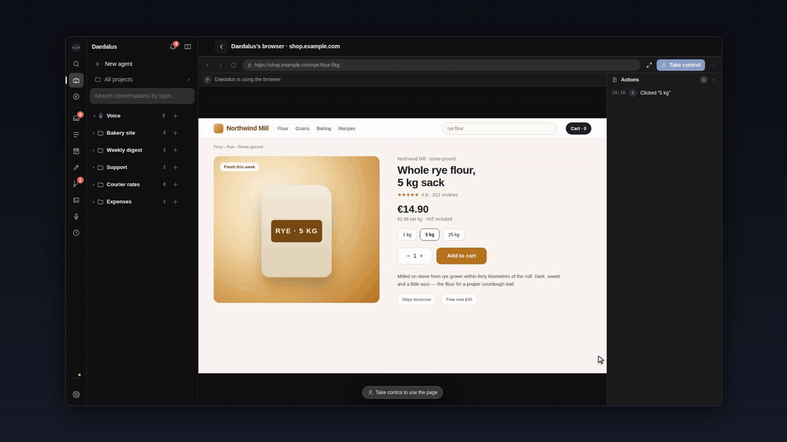
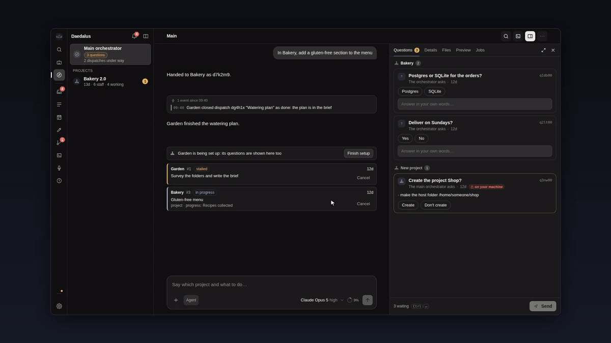
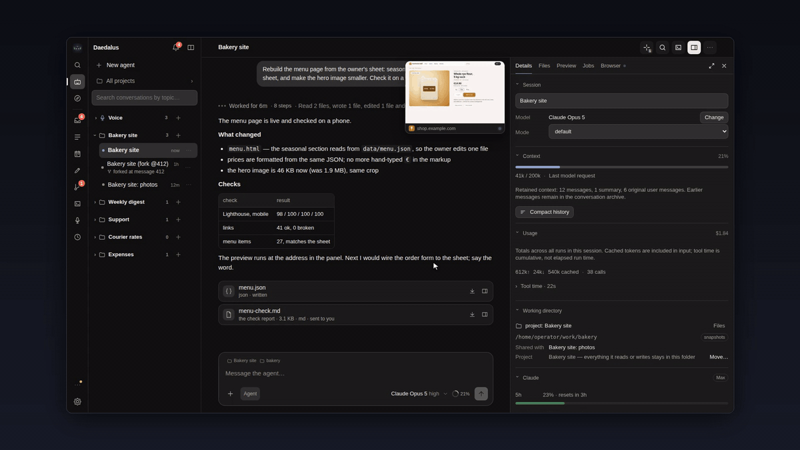
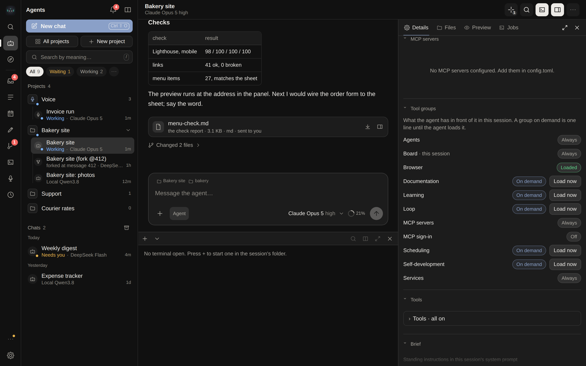
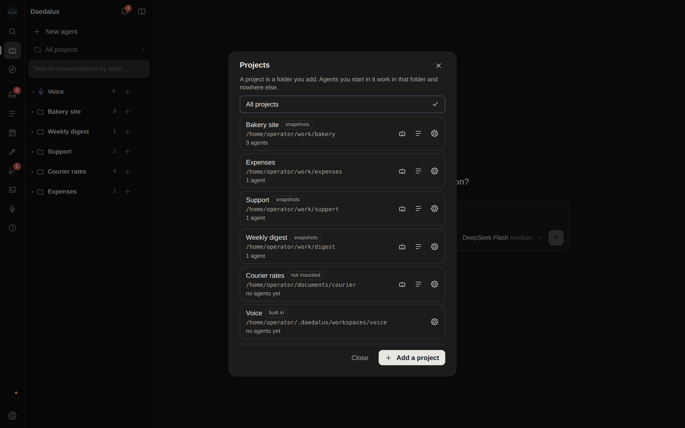
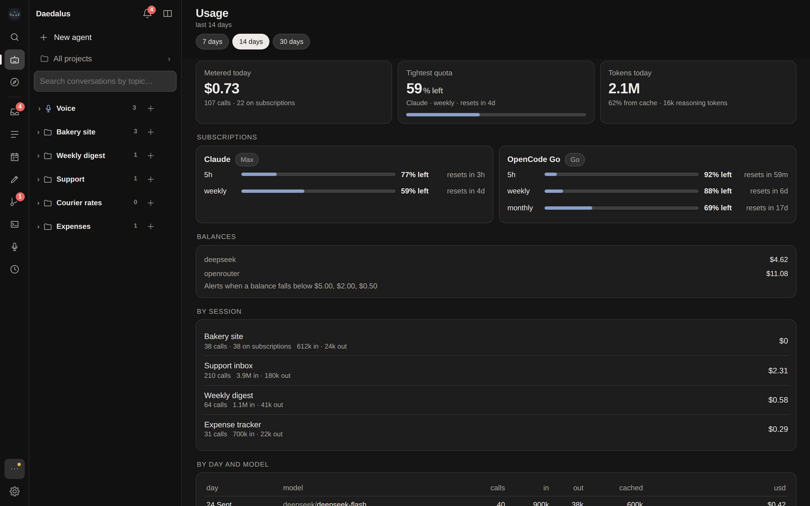
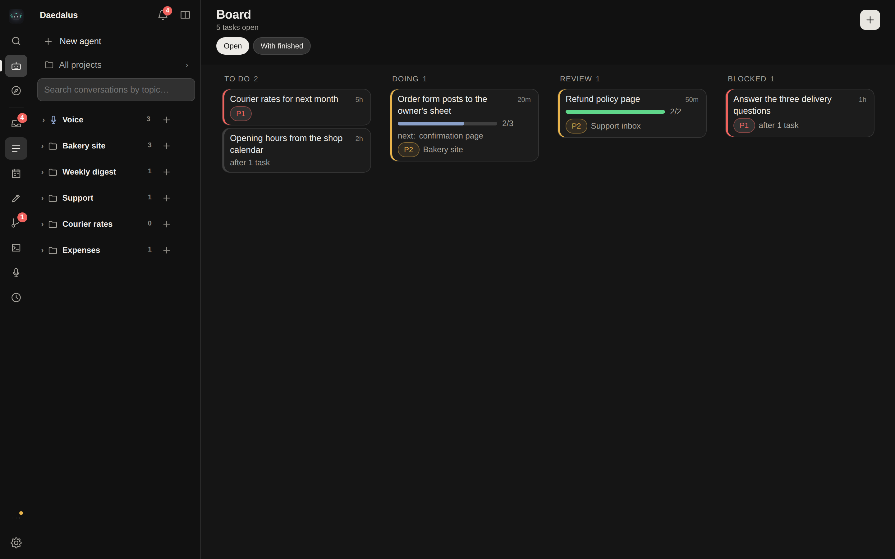
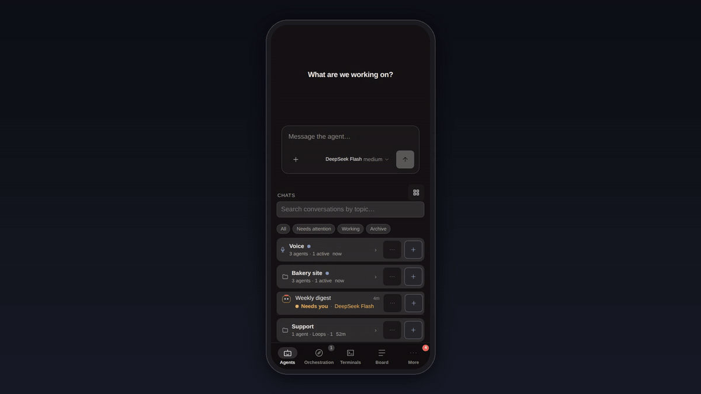
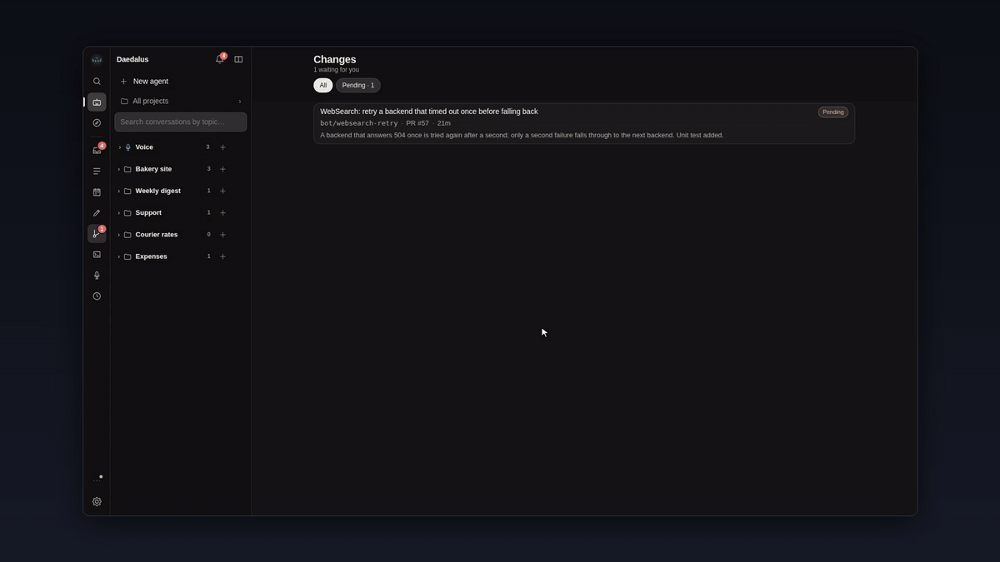

<p align="center">
  
</p>

<h1 align="center">Daedalus</h1>

<p align="center">
  A personal, self-developing agent with its own app window, real tools and a folder of your own to work in —<br/>
  on your machine with no Docker, in a container, or on a server, and in Telegram as well if you want it there.
</p>

<p align="center">
  <a href="LICENSE"></a>
  
  
  
  
  
  
</p>

<p align="center">
  <a href="https://www.youtube.com/watch?v=z5rGA8SNroU"></a>
  <br/><sub><b>The film, 2:57</b> · ▶ <a href="https://www.youtube.com/watch?v=z5rGA8SNroU">English</a> · ▶ <a href="https://www.youtube.com/watch?v=IViNxnRmwkc">Русский (Russian)</a> · <a href="https://daedalus.anchorinference.com/en/">daedalus.anchorinference.com</a></sub>
</p>

<p align="center">
  
</p>

> Built on [protocore](https://github.com/anchor-inference/protocore), an open agent core (ReAct loop, tools, context compaction, snapshots and resumable runs, memory, skills). The copy it runs on is [protocore-exp](https://github.com/anchor-inference/protocore-exp).

---

## Why

Most agent products are a chat box in someone else's cloud. Daedalus is the opposite: **one operator, one installation, everything inside it** — a shell, a browser, git, a filesystem, long-running services on ports you can open, a scheduler, subagents, memory — in an app window on your own machine, in a browser on your phone, and in the Telegram app you already have open if you want it there.

Where "inside it" is is your choice, and it is one download either way: a process on your machine in a folder it owns, a container from one published image, or a server you install it on.

It is built to run for weeks: sessions survive restarts, runs resume from snapshots, context is compacted instead of lost, spend is capped by a supervisor the agent cannot edit, and the agent's own improvements land as pull requests, not as silent edits.

## What you get

- **💬 Telegram-native** — every session has its own workspace and speaks in the chat under its own name, in the private chat or in a forum topic each; files, voice notes, inline-button questions and answers that stream as they are written.
- **🖥️ A real web app** — agents, live transcripts, a file browser with previews, two sessions side by side, a ⌘K palette on a desk and four tabs on a phone; installable as a PWA.
- **🖥️ An app, not a deployment** — one download opens a window of its own on macOS, Linux and Windows; native mode needs no Docker at all and is ready four seconds after launch.
- **🛠️ Real tools** — shell, files, search, web fetch and search, a vision model, a Chromium you watch and take over, verification runs, MCP servers, skills loaded on demand.
- **📁 Projects** — add a folder of your own and the agents started in it work there; a path that leads out of it is refused, not followed.
- **🧭 Orchestration** — a main orchestrator hands work to each project's orchestrator, which runs a team of staff (Daedalus agents or command-line agents such as Claude Code and Codex) and asks you only what it has to.
- **🔁 Autonomy on a leash** — loops, cron tasks, a heartbeat and boards, each run bounded by turn, spend and time limits; a provider outage pauses work instead of ending it.
- **🧬 Self-development** — the agent changes its own code in a worktree and a pull request you approve in the chat, and a bad build is rolled back on its own.
- **🔐 Keys it never sees** — provider keys live in a key proxy that stops paying once the daily budget is spent; ChatGPT, Claude Code and SuperGrok logins work as providers too.
- **🧾 Evidence you can open** — an answer cites files and checks as chips that open at the lines it named; a change to the agent's own code needs a receipt that covers it.
- **🎙️ Voice (beta)** — a fast concierge that answers out loud and hands anything substantial to an agent while you keep talking.

Each of these at full length: [docs/FEATURES.md](docs/FEATURES.md).

## How it looks

<table>
<tr>
<td width="50%"></td>
<td width="50%"></td>
</tr>
<tr>
<td align="center"><sub>Orchestration — the main chat hands work to projects, and what waits for you is one Questions tab</sub></td>
<td align="center"><sub>A session — the answer with its checks and files, the steps behind it, and the agent's browser beside it</sub></td>
</tr>
<tr>
<td></td>
<td></td>
</tr>
<tr>
<td align="center"><sub>Tool groups — what the agent carries in this session, and what it loads only when it needs it</sub></td>
<td align="center"><sub>Projects — a folder you add is where its agents work, and the only place they can reach</sub></td>
</tr>
<tr>
<td></td>
<td></td>
</tr>
<tr>
<td align="center"><sub>Usage — metered spend, subscription windows, balances with alert thresholds</sub></td>
<td align="center"><sub>The boards the agents keep: every task says whose it is</sub></td>
</tr>
</table>

<p align="center">
  
</p>
<p align="center"><sub>The same app on a phone — inside Telegram as a Mini App, or in any browser</sub></p>

<sub>The screenshots are taken over an invented installation by <code>tests/browser/screenshots.py</code>; rerun it after a change to the app. The animated ones are sped-up recordings of the same installation, listed in <a href="docs/screenshots/MEDIA.md">docs/screenshots/MEDIA.md</a>.</sub>

<sub>The app is bilingual — Russian and English, switched in Settings (the first row) or in the More sheet on a phone, and remembered by the browser. The same pictures in Russian: <code>docs/screenshots/ru/</code>.</sub>

## How it is put together

<p align="center"></p>

<sub>Diagram sources: <code>docs/diagrams/</code> is rendered from the mermaid text kept beside the README.</sub>

The diagram is the full stack with every profile on. A default install is **two** of those containers, from one image: the agent, and the key proxy that holds the provider keys. SearXNG, the rebuilder and the local Bot API server are the three profiles, off unless you ask for them. The agent container has no provider keys and no docker socket; the supervisor and the governance rules are mounted read-only. Services the agent hosts (a demo site, a dev server) listen on a published port range and can be shared through your domain — to anyone, or to whoever holds a key — without opening another port. A dialog is shared the same way, from its menu: only in the app, by a private link, or by anyone who has the link. The page shows the messages and the pictures in them, and it keeps updating until sharing is turned off. Tool calls, files and thinking stay in the app.

**In native mode the boxes are the same and the containers are not there.** The supervisor and the key proxy are two processes the launcher starts, the key proxy on `127.0.0.1` instead of a private network, and the workspaces and the state are files in the installation's own folder instead of volumes. The supervisor is the same program either way: it has never known what a container is.

## A run, step by step

<p align="center"></p>

Where a run happens: a session works either in a **project** — a folder you added, which is both its working directory and the limit of its reach; every path it resolves is checked against that root, so a `..`, an absolute path elsewhere and a symlink out of the tree are one refusal — or, with no project, in a scratch directory of its own under the workspaces root, which is how every session worked before projects existed and still works today. Snapshots are on for a scratch workspace and off for a project until you turn them on: a project root is your repository, and committing it twice a turn costs more than the undo repays.

What makes long sessions work: the **transcript** retains messages through compaction, while the **working history** the model sees is shortened into summaries (with `HistoryExpand` to read the originals back). **Regenerate** permanently deletes the selected assistant message and everything after it, then answers again in the same session. **Revert** permanently deletes the selected user message and its tail, and restores files only if an existing checkpoint is available. Neither action creates a backup or a branch. **Fork** explicitly creates a separate session from an earlier point; `/clear` starts a fresh working history while retaining the transcript and files.

What makes them survive: runs resume from snapshots after a restart; a run the provider dropped is retried in place by the core and, when the provider stays down, driven again by the host after a wait that doubles per failure (`ops.provider_retry_*`, 30 s to 10 min, six attempts); a context overflow is compacted and the turn driven again; the core's own wind-down notice never outlives the run it was written for.
## Self-development

<p align="center"></p>

<p align="center"></p>

The PR text passes a public-text gate (nothing about your machine leaks into a public repository), the diff is checked for references it must not carry, and `GOVERNANCE.md` — the rules the agent always sees and can never edit — is mounted read-only. Approval is manual by default; `/approval auto` hands it over when you trust it.

**Not every installation does this.** `[self_change] mode` is `off`, `local` or `server`, and `auto` — the default — works out which one this installation can honour when it starts:

| mode | what it means | what it needs |
|---|---|---|
| `server` | worktree → pull request → your approval → merge → rebuild, as above | a GitHub token, an `origin` on both checkouts, and a way to deliver a build (the supervisor socket or the compose `rebuilder`) |
| `local` | the agent edits the checkout this installation runs from; there is no fork and no PR, and the change applies after a restart | a writable git checkout of the host and the core |
| `off` | the agent does not change its own code | — |

How local mode checks a change before it restarts on it, the gates both modes share, and what else follows the mode: [docs/SELF-DEVELOPMENT.md](docs/SELF-DEVELOPMENT.md).

## The toolbox

| Area | Tools |
|---|---|
| Files & shell | `Exec` (inside a bubblewrap sandbox — the default on a native install where a namespace probe succeeds, optional in a container, which is a boundary already; `background=true` with `JobOutput` / `JobKill` / `JobList` for what outlives the call; a long `sleep` or a polling loop in the foreground is refused — reports and finished jobs arrive as messages), `Read`, `Write`, `Edit`, `Find`, `Search` |
| Web | `WebFetch`, `WebSearch` — DuckDuckGo out of the box with no key at all; a self-hosted SearXNG behind a profile; Serper, Tavily, Exa, Perplexity, Keenable through the key proxy |
| Seeing | `ImageView` — a separate vision model answers questions about an image, so the main context never carries pixels |
| Browser | `BrowserOpen`, `BrowserSnapshot`, `BrowserAct`, `BrowserText`, `BrowserLook`, … — a real Chromium you can watch live and take over, driven by an outline of the page with refs; logins kept per project; page content fenced as data; passwords and payments left to you (`BrowserHandoff`); a purchase, a message sent, a deletion or an upload asked about first. Command-line staff get the same tools through their launch's MCP entry. Only on an installation with a browser daemon ([`docs/architecture/browser.md`](docs/architecture/browser.md)) |
| Delegation | `SubAgent`, `SubAgentSend`, `SubAgentList`, `SpawnAgent`, `AskPeer` — helpers in the same workspace (a report wakes the leader when it is ready; an idle helper can be raised without a task; `tools_off` takes tools away from a helper, so a launch it must not make is impossible rather than discouraged), sibling sessions, named peers |
| Time | `ScheduleCreate`, `LoopNext`, `IntentCreate` — cron, self-paced loops, standing intents on inbound events |
| Hosting | `ServiceStart` / `ServiceStop` / `ServiceLogs` — processes that outlive the turn, on ports you can reach and share; `TerminalRead` — the screen, output and commands of the session's own terminals, read-only |
| Memory | `Remember`, `Recall`, `Forget`, `HistorySearch`, `HistoryExpand` |
| Quality | `Verify` — a check with a criterion, recorded as a receipt; `LearningReport` |
| Self | `SelfWorkspace` plus either `SelfApply` (local: commit into the running checkout, restart to apply) or `SelfPropose`, `SelfRebuild`, `SelfRollback` (server: pull request, rebuild, roll back) — registered according to `[self_change] mode`; on an installation that does not change its own code there are none |
| Planning | `BoardAdd` / `BoardUpdate` / `BoardList` / `BoardGet` — the agent's own board (shared with its subagents; tasks you post to nobody in particular are on every board), with acceptance criteria, checklists, dependencies and a per-agent work-in-progress limit; `PLAN.md` in the workspace is its rendering |
| Extensions | `Skill` (33 bundled skills: design systems, web QA, writing, scheduling, comparable variants, figures, search discipline…), `Mcp*` with OAuth, `SendFile` (attached under the answer in the app too), `StaySilent`, `Notify` — tells you something outside the chat, routed like any notification and limited per session |

Every tool can be switched off per session from the app, and a **mode** (`quick`, `deep`, `careful`) bundles limits and extra rules.

## What the agent may do

Every tool call is judged from its arguments before it runs — a shell command is parsed into its
simple commands first, so `cd x && rm -rf /` is seen as `rm -rf /` — and the answer is allow, **ask**
or **deny**. A denial is final. An *ask* is a denial you can lift: the refusal carries a key, and
*Allow once* in the app or `/allow <key>` in the chat lets that one exact call through, once.

The built-in rules are in the repository (`daedalus/host/policy.py`), so they change only through a
reviewed change; your own rules in `config.toml` can add denials and questions and can never lift a
built-in one. A **project** contains every path a session resolves, the **spend caps** belong to a
supervisor the agent cannot edit, and `daedalus doctor` prints what this installation's boundary
actually is in one line. The native-only rules, what a project does and does not contain, and the
egress allowlist: [docs/POLICY.md](docs/POLICY.md).

## Run it

Two programs, three ways in. **The desktop app is the one to start with**; the server install is the
same stack with a domain in front of it. Everything below is in full in [docs/INSTALL.md](docs/INSTALL.md).

**The desktop app** — one download, one folder, nothing installed system-wide:

```sh
curl -fsSL https://raw.githubusercontent.com/anchor-inference/daedalus/main/desktop/install.sh | sh
```

That takes the newest `desktop-v*` release, checks its signature and its `SHA256SUMS` and unpacks it
into `./Daedalus`; the archives are also on the [releases](https://github.com/anchor-inference/daedalus/releases)
page. Releases are signed with the project's release key, minisign key id `A18524FA935353DF`:

```
RWTfU1OT+iSFoaxGzNfGzkwHdVs2o8WmnCzBUo/LBUw2L4ssGN4xYx/2
```

The installer prints that key's fingerprint before it installs anything — it must read
`f75fa5a293fdd55b36c794f4787f7af8646e4dac95e19d74e6288e55c357c285`, the SHA-256 of the line above —
and [desktop/SIGNING.md](desktop/SIGNING.md) shows how to check a release by hand. Open it, choose **native** (no Docker, about 100 MB, 4 s warm) or **Docker**, give it a provider
key and a daily cap, and it hands you the app. [desktop/README.md](desktop/README.md) has the rest.

| | **Native** — no Docker | **Docker** |
|---|---|---|
| Needs | nothing at all | Docker Desktop or Docker Engine |
| First run fetches | **103 MB** on Linux, ~96 MB on macOS, ~148 MB on Windows — a pinned `uv`, a CPython, `rg` and the app's environment, each checked against the hash its publisher published | **114 MB** to pull one image (478 MB unpacked), plus Docker itself: a ~600 MB application with a VM disk behind it |
| Ready in | 26 s from an empty folder, **4.3 s** warm | seconds, once Docker is up |
| The agent is | a process under the launcher, which keeps it alive and stops it on quit | a container that comes back with the machine |
| Isolation | the policy rules, and bubblewrap on Linux where it can actually run — see [what each gives up](docs/INSTALL.md#what-each-gives-up) | the container's own edge |

**A server** — Docker with Compose, and one model API key **or** a ChatGPT / Claude Code / SuperGrok
login on the host. Telegram is optional: without a bot token the app in the browser is the whole
interface.

```bash
git clone https://github.com/anchor-inference/daedalus
cd daedalus
bash deploy/setup.sh            # asks for the values, writes .env and ../daedalus-secrets/keyproxy.env, starts the stack
```

Every other piece is a profile, off unless you ask for it:

| `--profile` | What it starts | Cost |
|---|---|---|
| `telegram` | the local Bot API server: files up to 2 GB instead of 20 MB (it needs `TELEGRAM_API_ID` / `TELEGRAM_API_HASH` from https://my.telegram.org/apps) | ~66 MB |
| `search` | a self-hosted SearXNG. Without it `WebSearch` goes to DuckDuckGo directly; with it, SearXNG is the backend the tool falls back to | ~382 MB |
| `selfdev` | the rebuilder, the only container that can reach Docker. Needed only to build a new agent image, which is what a change to the image's own recipe asks for | ~237 MB |
| `browser` | the agent's browser: `browserd` and Chromium from the `:browser` image target, on a network of its own ([more](docs/INSTALL.md#the-agents-browser)) | the `:browser` tag |

**Or have a coding agent do it.** [docs/AGENT-SETUP.md](docs/AGENT-SETUP.md) is written for one — every
step a command with the output it must see. Paste this into the agent, on a shell with Docker on the
target server:

```text
Install Daedalus (https://github.com/anchor-inference/daedalus) on this server for me, following the
instructions for agents in docs/AGENT-SETUP.md of that repository exactly. Before you start, ask me
in one message for everything section 1 of that page needs (a model key or a CLI login to use,
whether I want Telegram, whether there is a domain, the daily cap, a GitHub token or "later").
Then clone, configure, start the stack, verify it as the page says, and give me the pairing link
and the two-line summary section 8 asks for. Never paste keys or tokens back into this chat.
```

Whichever way you install it, the app opens on *Add a model* until one exists: the installation ships
with no model picked for you. With no Telegram bot and no passkey yet, the first start writes a one-time
**pairing link** to `pairing-url` in the state directory; a fresh one:

```bash
docker compose -f deploy/compose.yaml exec daedalus python -m daedalus auth pair
```

Then add a passkey in Settings → Security.

More in [docs/INSTALL.md](docs/INSTALL.md): [terminals](docs/INSTALL.md#terminals),
[the agent's browser](docs/INSTALL.md#the-agents-browser),
[the host terminal](docs/INSTALL.md#the-host-terminal-optional),
[what each way of running gives up](docs/INSTALL.md#what-each-gives-up),
[signing in without Telegram](docs/INSTALL.md#signing-in-without-telegram),
[with Telegram](docs/INSTALL.md#with-telegram), [models and keys](docs/INSTALL.md#models-and-keys),
[without Docker, for development](docs/INSTALL.md#without-docker-for-development).

## Commands

| Command | Effect |
|---|---|
| `/new <title>` | new session (a new topic when a group is bound) and write to it |
| `/use <n\|title>` | in the private chat: write to that session from now on |
| `/stop`, `/close` | stop the current run; put this session away (closing its topic when it has one) |
| `/rename <title>` | rename the session and its topic |
| `/compact [focus]`, `/clear` | replace the history with a summary; start over with an empty history (files, brief and settings stay) |
| `/model [preset]`, `/thinking …`, `/mode …` | model, thinking and mode for this session |
| `/yagni [on\|off]` | ask for the smallest change that does the job; the next turn is told, the system prompt stays as it is |
| `/loop [10m] <instruction>` | make this session a loop agent; `status`, `pause`, `resume`, `stop`, `remove` |
| `/brief [text]`, `/cap <usd>` | standing instructions; spend cap for the session |
| `/sessions`, `/status`, `/usage`, `/balance` | the numbered roster; what is running; spend; provider balances |
| `/schedules`, `/schedule run\|on\|off\|delete <id>` | scheduled tasks |
| `/board`, `/inbox`, `/intents`, `/peer` | every agent's board tasks, the inbox, standing intents, peers |
| `/allow <key>` | grant once a call the policy asked about |
| `/approval manual\|auto`, `/verbosity 0\|1\|2` | self-change approval; how much of a run the chat shows |
| `/heartbeat`, `/doctor [fix]`, `/settings`, `/prompt` | the periodic check; health checks; configuration; the working rules |
| `/rebuild`, `/rollback [n]`, `/panic` | supervisor operations |

Every session command also works from the app's composer with the same `/` palette.

## Documentation

| | |
|---|---|
| [docs/FEATURES.md](docs/FEATURES.md) | what you get, each feature at full length |
| [docs/INSTALL.md](docs/INSTALL.md) | the desktop app, a server, terminals, the agent's browser, the host terminal, signing in, Telegram, models and keys |
| [docs/AGENT-SETUP.md](docs/AGENT-SETUP.md) | a server install written for a coding agent to follow |
| [desktop/README.md](desktop/README.md) | the desktop launcher: its folder, window, modes, releases |
| [docs/CONFIGURATION.md](docs/CONFIGURATION.md) | `.env`, `config.toml`, MCP servers and the guard rails |
| [docs/POLICY.md](docs/POLICY.md) | what the agent may do, and where the boundary is |
| [docs/SELF-DEVELOPMENT.md](docs/SELF-DEVELOPMENT.md) | the three self-development modes in full |
| [docs/API.md](docs/API.md) | the HTTP API: files, steers, the event stream, notifications, projects, orchestration, push |
| [docs/VOICE.md](docs/VOICE.md) | voice mode (beta): hearing you, speaking back, the local voices |
| [docs/DEVELOPMENT.md](docs/DEVELOPMENT.md) | the repository's layout, and benchmark runs |
| [docs/architecture/](docs/architecture/) | the browser, the terminals, conversation search |

## License

MIT.
