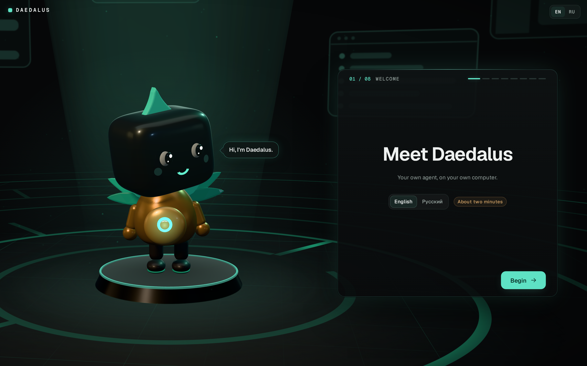

# Daedalus on your own machine

**Daedalus** is a desktop application for Windows, macOS and Linux: install it like any other, open
it from the Start menu, Launchpad or the application menu, and it sets itself up in its own window —
it lays out the two repositories it came with, asks the handful of questions the installation needs,
writes the environment files — and then runs the agent one of two ways and shows the app in that same
window.

It is two programs in one installation. The **application** (`Daedalus.exe`, `Daedalus.app`,
`daedalus`; Electron, in `shell/`) is the window, the menu entry, the icon and the notifications.
The **launcher** beside it (`daedalus-desktop`; Go, in this folder) is the engine: the setup, the
runtime, the agent's supervisor, the update manager. The application starts the launcher as a
background process of its own — no console window on any system — and shows what it serves; the
launcher is also the command line, for everything below that a terminal does.

**The first run asks which**, and the choice is written next to the data and never asked again
(`--mode docker` / `--mode native`, or `DAEDALUS_MODE`, answers it from a script):

| | Native | Docker |
|---|---|---|
| **What it needs** | nothing | Docker Desktop (macOS, Windows) or Docker Engine with the compose plugin |
| **What runs the agent** | a process under the launcher, out of a private folder of pinned, checksummed binaries | a container from one published image, with its own filesystem and its own network |
| **First run downloads** | **nothing**: the code, the runtime and every package come inside the application ([the seed](#the-seed)); a launcher without one, built from source, downloads 103 MB on Linux x86-64, ~96 MB on macOS, ~148 MB on Windows | **114 MB** to pull the runtime image — 478 MB once unpacked — plus Docker itself, which is a ~600 MB application with a multi-gigabyte VM disk behind it |
| **On disk** | 245 MB of runtime in the user's cache folder (73 MB of it a wheel cache you can delete), 390 MB for the whole installation | 478 MB of image, plus the volumes |
| **Start to app** | **24 s** from an empty folder on a Windows 11 desktop, whatever the line (37–126 s when it downloaded), **4.3 s** warm | the image pull, then seconds; Docker Desktop itself must be up first |
| **Browser** | `daedalus-desktop install browser` — both Chromium builds into the runtime's `browsers/` ([the agent's browser](#the-agents-browser)) | `COMPOSE_PROFILES=browser`: the `browser` service from the `:browser` tag of the same image, sharing every layer below the last |
| **Isolation** | **no container boundary** — `Exec` runs as you, behind the policy rules ([the isolation, honestly](#the-isolation-honestly)) | a command that goes wrong stops at the container's edge |

Neither is the "real" one. Docker buys a wall; native buys weight and speed, and
[Native mode](#native-mode) says exactly what the wall was doing and what still stands without it.
Nothing is ever installed system-wide either way, and Docker is never installed for you.

Everything is shown in the application's own window — the launcher's setup and progress pages
first, the app once it answers — and nothing in the browser. A link in the app that leaves this
machine opens in your browser; everything on this machine stays in the window.
[The window](#the-window) has the rest.

The application is about 230 MB to download on Windows and Linux and 400 MB on macOS: Electron's own
Chromium, and [the seed](#the-seed) — the code, the runtime and the packages a first run would
otherwise download (about 115 MB for one system; the Mac carries both of its own). In Docker mode
everything that runs is in containers; in native mode the launcher lays the runtime out into a folder
in the user's cache location and runs it from there.

## Get it

From the [releases page](https://github.com/anchor-inference/daedalus/releases) (the tags beginning
with `desktop-v`):

| Machine | File | How |
|---|---|---|
| Windows 10 and 11, x86-64 | `Daedalus-Setup-x64.exe` | Run it: Next, Install, Finish. It installs for you only, into `%LOCALAPPDATA%\Programs\Daedalus`, with no administrator; Daedalus is in the Start menu and on the desktop, and *Run Daedalus* on the last page opens it. |
| macOS 12 and later, Apple Silicon and Intel | `Daedalus-macOS.dmg` | Open it and drag **Daedalus** onto **Applications**. |
| Debian, Ubuntu and their relatives | `Daedalus-linux-amd64.deb`, `Daedalus-linux-arm64.deb` | `sudo apt install ./Daedalus-linux-amd64.deb`, or open it with the software centre. Daedalus is in the application menu, and `daedalus` on the PATH. |
| Any other Linux | `Daedalus-linux-x86_64.AppImage`, `Daedalus-linux-arm64.AppImage` | Make it executable (`chmod +x`, or *Properties → Allow executing*) and open it. |

**Neither the Windows installer nor the macOS application carries a paid code signature** — there
is no Authenticode certificate and no Developer ID — so each system warns once:

- **Windows**: SmartScreen says *Windows protected your PC*. Choose **More info → Run anyway**. Only
  the installer asks; the installed application opens normally.
- **macOS**: the application is signed ad-hoc, and macOS refuses the first opening of a copy that
  came through a browser ("Apple could not verify…"); since macOS 15 the right-click *Open* no longer
  gets past it. Open it once, then **System Settings → Privacy & Security → Open Anyway**. Or in
  Terminal: `xattr -dr com.apple.quarantine /Applications/Daedalus.app`. Only the first opening
  asks.
- **Linux** asks nothing. An AppImage on Ubuntu 24.04 and later runs without Chromium's sandbox,
  because the system forbids the namespaces it needs to an AppImage; the `.deb` keeps the sandbox
  (it installs the AppArmor profile that allows them).

**Checking what you downloaded.** Every release lists every file in `SHA256SUMS`, signed by the
project's release key; the application and the launcher check that signature on every update they
install. The installer you downloaded yourself is checked by you, once: [SIGNING.md](SIGNING.md)
shows how. The key's fingerprint must read

```
f75fa5a293fdd55b36c794f4787f7af8646e4dac95e19d74e6288e55c357c285
```

the SHA-256 of the key line `RWTfU1OT+iSFoaxGzNfGzkwHdVs2o8WmnCzBUo/LBUw2L4ssGN4xYx/2` (minisign key id
`A18524FA935353DF`), published here and in every release's notes.

### From a terminal

One line on macOS and Linux installs the same application into a folder of your choosing — no
browser, no administrator — after checking the release's signature and the download against
`SHA256SUMS`, and unpacks it into `./Daedalus`:

```sh
curl -fsSL https://raw.githubusercontent.com/anchor-inference/daedalus/main/desktop/install.sh | sh
```

On Windows, the same in PowerShell (run on Windows by the release workflow's tests):

```powershell
irm https://raw.githubusercontent.com/anchor-inference/daedalus/main/desktop/install.ps1 | iex
```

Both print the release key's fingerprint before they install anything. `DAEDALUS_DIR=/somewhere/else`
puts it elsewhere. Run over an installation that already has data, neither script replaces anything
itself: the launcher's `upgrade` does it — the installed one, or for a launcher older than that
command the one just downloaded — after a yes and with the data protected first (a kept copy of the
data folder on Linux with ext4, a checked backup elsewhere), and it rolls back on failure.
[UPDATES.md](UPDATES.md) has the whole of it.

The archives they fetch — `daedalus-desktop-windows-amd64.zip`, `Daedalus-macOS.zip`,
`daedalus-desktop-linux-<arch>.tar.gz` — are on the releases page too, and are the same application
unpacked. On macOS unzip with Finder or `ditto -x -k`, not with `unzip`, which drops the bundle's
symlinks and leaves an app macOS calls damaged.

### From an installation made before the application

Launchers before the application kept the data in `data/` beside themselves. Such an installation
upgrades into the application the usual way (its `upgrade`, or the one-liner over its folder), and
the first start of the application moves `data/` into the per-user folder below — a rename, nothing
copied, refused while anything still uses it. A `DATA-MOVED.txt` in the old folder says where it
went.

Installed fresh with an installer, the application starts with an empty data folder. To bring an
older installation's data in, close Daedalus and run, from a terminal,

```sh
daedalus-desktop import /path/to/the/old/folder        # the folder with data/ in it, or data/ itself
```

(`& "$env:LOCALAPPDATA\Programs\Daedalus\daedalus-desktop.exe" import C:\path\to\old\folder` on
Windows, `/Applications/Daedalus.app/Contents/MacOS/daedalus-desktop import …` on macOS). It is the
same move, and refuses the same way.

## What happens on the first run

1. A page opens and asks **Docker or native**, with what each costs written next to it. A machine
   with a running Docker is offered Docker; a machine without one is offered native, because the
   alternative there is installing a whole application first. In Docker mode the client is then
   looked for in the places the installers put it — a program started from Finder inherits a PATH
   with none of them in it — and without it the launcher says what to install and waits there. In
   native mode nothing is checked, because nothing is expected.
2. The two repositories are unpacked into the folder from the copy the application carries — the
   tree of the release's own commit ([the seed](#the-seed)) — or, by a launcher with no such copy,
   fetched as GitHub tarballs of `main`, and committed there — with `git` running inside the agent's
   own image in Docker mode, and with the runtime's own git in native mode. Each checkout is a real local history with
   no remote — an update is the next commit on top of it.
3. The application's window shows the launcher's page (`http://127.0.0.1:8770`, or any free port):
   a short wizard with Daedalus beside it — how it runs, a model, a daily spending limit, Telegram
   (optional; without it you use the app in that window), the advanced settings, a summary, and the
   start itself. The page is in English or Russian; the switch is in its corner and the choice is
   remembered.
4. **Docker:** the image is pulled (or built, if there is no published image for your platform),
   the stack comes up, and the same window moves to the app. One image, two containers from it: the
   agent, and the key proxy that holds the provider keys.
   **Native:** the runtime is taken from the seed and checked (downloaded where there is none), the
   environment is built from the checkout's own lock file out of the packages the seed carries,
   offline, and the launcher starts the supervisor and the key proxy as its own child
   processes. Same two programs, same key file, no container between them and the machine.
5. **The app asks for a model, and that is the last step.** A key is an address; which model runs on
   it — and what it costs — is yours to pick, so the installation ships with none. The app opens on
   *Add a model*: choose the endpoint, choose a model from the list it serves (its context window,
   its modalities and its prices are shown), save. Nothing runs before that, and everything does
   after it. Later ones are added the same way from Settings → Models.

**In Docker mode, closing the launcher does not stop anything**: the containers are
`restart: unless-stopped` and come back with the machine, and the launcher's page is only a remote
control. **In native mode it does stop the agent**, and that is deliberate rather than a setting: a
container is visible in `docker ps` and has a restart policy of its own, while a supervisor started
by the launcher is an ordinary process with nothing above it and no window to say it is there, and
an agent you cannot see is one you cannot stop. A run in flight is not lost — the supervisor gives
the bot 25 seconds to drain, the run is snapshotted, and it picks up where it left off on the next
start.

Opening the application a second time does not start a second one. It brings the first window to
the front, hands it the link it was opened with if it was opened with one, and exits. It finds the
first by `data/launcher.json` — the port that launcher's page really got and the token it minted —
and never by a fixed port.

### The ports choose themselves

Nothing on this machine has to be cleared out of the way for Daedalus. The window is told the
app's address by the launcher, a `daedalus://` link is resolved against the installation's own
settings, and the agent reads its ports from the environment the launcher gives it — so a port that
another program (an older Daedalus, a dev server, anything) already holds is moved off, not fought
over:

| | default | in |
|---|---|---|
| the app and its API (`API_PORT`) | 8765 | both modes |
| the key proxy (`KEYPROXY_PORT`) | 3201 | native |
| the supervisor (`DAEDALUS_SUPERVISOR_PORT`), where it listens on TCP | 8769 | native, Windows |
| the agent's services (`SERVICES_PORT_RANGE`) | 8100–8119 | both modes |
| servers in a container terminal (`TERMINALS_PORT_RANGE`) | 8120–8139 | Docker |
| the launcher's own page | 8770 | both modes |

- **A first setup** writes the defaults where they are free and a free port near each one where
  they are not (or one the system hands out, when nothing near is free). A range moves as one
  block to a block that is wholly free.
- **Every start** checks the ports in `data/.env` again before anything listens. One that something
  else has taken since moves the same way, is written back, and the launcher's log says which port
  moved, from where, to where and why. The other program is never stopped or signalled.
- **A port is kept once chosen.** The default coming free again does not move the installation
  back: the browser keeps what the app stores per address, and moving it for nothing would cost the
  window its drafts and settings. A port you write into `data/.env` by hand is yours, and is kept
  for as long as it is free.
- **What is the installation's own is not "something else".** Natively, what a launcher that died
  left running is stopped first; a bot whose supervisor died first is recognised by the boot id it
  answers with, keeps its port, and the start refuses as it always did — moving away from it would
  put two bots on one database. In Docker mode a port the project's own running containers publish
  is theirs; if compose cannot say what it runs, the ports are left as they are.
- **The services' range natively** moves only when nothing in it is left: the agent skips a port
  that is taken anyway, and a service left running from an earlier start keeps its address.
- **The launcher's page** does not need a record at all: when 8770 is taken it listens wherever the
  system lets it, and the window, a second start (`launcher.json`) and the agent's own sealed ports
  all read where it ended up.

## The pages

The launcher serves three pages of its own, on the loopback address and nowhere else.

- **The questions** (`/setup`) — a wizard of eight steps, every answer of which the launcher acts
  on:
  - *How it runs* — on this machine or in a container, with a badge that says whether Docker answers
    here.
  - *Model* — one of three: an API key (DeepSeek, OpenRouter, OpenCode, OpenAI, Anthropic; written
    to `daedalus-secrets/keyproxy.env`, which only the key proxy reads), a CLI you are already signed
    in to (Codex, Claude Code, Grok — found the way the app finds them: the CLI's own status command,
    else the login file the key proxy serves it from), or a local / OpenAI-compatible server. For
    the last, the launcher itself asks the address you typed for its models — no redirect followed,
    nothing else asked — and the one you pick becomes the app's default model through the key proxy
    (`KEYPROXY_UPSTREAM_LOCAL` and `KEYPROXY_KEY_LOCAL` for the proxy, `DAEDALUS_LOCAL_MODEL` for the
    app). In Docker mode a loopback address is written as `host.docker.internal`, which is where the
    proxy's container finds your machine.
  - *Spending* — US dollars a day, enforced by the supervisor and by the proxy.
  - *Telegram* — the bot token, your id, the API id and hash; skippable.
  - *Advanced* — the language; the ports, chosen automatically, with the app's port shown and
    fixable (a fixed port is named in `DAEDALUS_FIXED_PORTS` and a start stops rather than moving
    it); the data folder, shown read-only — it is chosen when the launcher starts (`--data`), and an
    existing one is brought into a new folder with `daedalus-desktop import`; start at login, per
    user (a `~/.config/autostart` entry on Linux, a LaunchAgent on macOS, the `Run` key on Windows),
    which the status page turns off again; the browser component (the `browser` extra natively, the
    browser image's compose profile in a container); and voice (off; local, the `speech` extra; or
    cloud, through your OpenAI key).
  - *Summary* — every line goes back to its step. *Start* follows the launcher's own start and its
    *Open* button opens the app in the window.

  Opened again (*Change the configuration*), the wizard starts from what is in force. A stored
  secret is shown as its last four characters and kept unless something is typed over it.

  The stage is three.js (MIT, `ui/assets/setup/vendor/Three-LICENSE.txt`) and the type is Geist
  (SIL OFL 1.1, `ui/assets/setup/fonts/Geist-OFL.txt`), both carried in the launcher: the page
  loads nothing from the network. Without WebGL the same wizard runs over a still picture, and a
  system set to reduce motion gets cross-fades instead of the acts.
- **The wait** (`/progress`) — where a start has got to: the steps of the mode you are in, ticked off
  as they pass; under them the one thing that is moving — an archive downloaded or unpacked with its
  megabytes, its total and a percentage, uv's own lines while the environment is built — and one line
  of the launcher's own commentary. The bar is the moving thing's: determinate whenever its size is
  known (the runtime archives are pinned, so their sizes are known before the first byte), and
  indeterminate otherwise. When nothing has moved for three seconds the page says *Still working* and
  for how long, so a long step never looks like a hung one. A failure becomes one calm card with the
  button that tries again.
- **The status** (`/status`) — what is running, the buttons the command line has, and the log behind
  a summary.

Both languages are complete: every line of every page is in a table in `i18n.go`, and a key in one
language and not the other fails a test rather than leaving an English sentence in a Russian page.
The choice is written to `data/lang` beside `data/mode`, so the next start opens in it. What the launcher is
doing is a sentence in the same language, chosen by the stage it has reached, and its own running
commentary sits under that in monospace, shown as what it is: the same words that go to the
terminal. A failure the launcher recognises — no network, Docker not answering, a port taken, a full
disk — is a sentence too, with the program's own text kept behind *What happened*.

<p align="center">
  
</p>

Pictures of all three, in both languages, at a window's width and a phone's, are in
`docs/screenshots/launcher-*.png`; `tests/browser/launcher_shots.py` renders them against an
invented installation and checks there that a language switch loses nothing that was typed.

## The folder

What the installation owns is one folder per user, apart from the program — the installers replace
the program, and nothing they do touches this folder:

| | The data folder |
|---|---|
| Windows | `%LOCALAPPDATA%\Daedalus\data` |
| macOS | `~/Library/Application Support/Daedalus/data` |
| Linux | `~/.local/share/daedalus/data` (`$XDG_DATA_HOME/daedalus/data`) |

Not Documents: on Windows that is very often a OneDrive folder, and a folder of git checkouts and a
live SQLite database under a sync client is one whose files are locked and rewritten behind the
agent's back. `--data DIR` names another folder for a terminal command.

```
data/
  daedalus/               the bot checkout; deploy/compose.yaml runs from here
  protocore-exp/          the core checkout
  daedalus-secrets/
    keyproxy.env          provider keys (0600) — outside every folder the agent can read
    ssh/                  keys and config for hosts the agent may reach; may stay empty
  .env                    what compose interpolates and the agent container reads; the ports the
                          installation chose for itself are kept here
  compose.desktop.yaml    the launcher's override: the published image, Telegram made optional
  launcher.json           the running launcher's port and token (0600) — how a second start finds it
  scheme.txt              which executable daedalus:// links are registered to, for a launcher on its own
```

In **native mode** the same folder also holds the data a container would have kept in volumes:
the database, the sessions and the workspaces are files here. What can be rebuilt — the runtime —
and this machine's own state live outside it, so that an update copies and protects only what
cannot be rebuilt ([UPDATES.md](UPDATES.md#the-runtime-lives-outside-the-data-folder) has where, per
platform):

```
  data/
    mode                    docker or native, written once and read on every start
    state/                  the database, the sessions, the pairing links, the known-good history
    workspaces/             one per session

  <runtime>/                ~/.cache/daedalus/<key> on Linux; …/Daedalus/Runtime beside the data elsewhere
    uv/uv                   the installer for everything below it
    python/                 the CPython uv manages, for this installation only
    envs/<digest>/          the environment the agent runs in, one per lock file of the checkout
    bin/rg                  what Search uses
    git/                    MinGit — Windows only; elsewhere git is the machine's own
    node/  browsers/        extras, fetched on demand
    cache/                  uv's wheel cache; safe to delete, and the next sync refills it
    installed/              which version and which hash each tool was unpacked from

  <local state>/            ~/.local/state/daedalus/<key> on Linux, …/Daedalus/State beside the data elsewhere
    logs/                   launcher.log (the launcher under the application), upgrade.log, and the
                            supervisor's, the key proxy's and the terminal daemon's output
    pids/                   the records of running children
    ptyd/run/  ptyd/state/  the terminal daemon's endpoint and token (sealed), its journal of agent writes
    browserd/               the browser daemon's endpoint and the agent's browser profiles (sealed)
    supervisor.sock         the supervisor's socket
```

The window's own state — its caches, where it was, its log `logs/shell.log` — is Electron's, in
`%LOCALAPPDATA%\Daedalus\Shell`, `~/Library/Application Support/Daedalus/Shell` and
`~/.config/Daedalus`.

This is the layout a server install has, which is why the repository's compose file runs against it
unchanged. Provider keys are deliberately not in `.env`: that file is mounted into the agent
container, and the key proxy's file is not.

To use a fork, set `DAEDALUS_GIT_REMOTE` and `DAEDALUS_CORE_GIT_REMOTE` before the first run: the
image is pulled from the fork owner's namespace as well, so a fork's code never runs upstream's
image. A fork that publishes no image has nothing to pull, and the first start builds it locally
instead. Both remotes must be GitHub repositories — the checkouts are fetched from
`codeload.github.com`, not cloned.

### The launcher runs the Python from the published branch, so releases go core first

The launcher is a binary; the supervisor and the key proxy it starts are `launcher/supervisor.py` and
`deploy/keyproxy/proxy.py` **out of the checkout it fetched**, which is the published branch and not
the tree the launcher was built from. So a launcher built from a branch whose Python has not been
published yet pairs with code that does not have that branch's fixes, and the two disagree silently:
the launcher passes `KEYPROXY_HOST=127.0.0.1` and a proxy that predates that variable binds every
interface anyway.

A first run from the seed is the exception: its checkouts are the commit the launcher was built
from, and the core's `main` of the same moment, so the two agree from the start. The next update moves
them to `main` like any other.

Release in the order **core → checkout → launcher**: publish the Python to the branch the launcher
fetches first, and cut the `desktop-v*` tag afterwards. Where the two must be able to disagree —
they always can, since the checkout moves on `update` — the Python side is written to fail safe on
its own: the key proxy binds the loopback interface unless something asks it for more, and a base URL
persisted against a container's address is migrated to this machine's on start rather than trusted.

Double-clicked from Finder there is no terminal to read, so the launcher's page opens in the browser
first and everything — the progress, a Docker that is not installed or not started, and the buttons
to try again — is on it. The launcher keeps serving that page whether the start succeeded or not;
closing it leaves the containers running.

## Projects

A project is a folder of your own — a repository, a directory of documents — that you add in the app
(Projects in the rail, the grid icon on the Agents screen). The agents you start in it work in that
folder: every path they *resolve* is checked against the project root and one that leads out of it is
refused — the file tools, the file browser, the preview, the download and the files they send you,
all at the one point that turns a path into a place. `Exec` runs **in** the folder and is bounded by
whatever bounds a command here: the sandbox where one is switched on, and the policy rules where it
is not (see [What the agent may do](../README.md#what-the-agent-may-do)). Several agents share one
project and see the same files. An agent started without a project still gets a scratch directory of
its own, as before.

A session writes five directories into the folder it works in — `inbox/`, `.exec/`, `.jobs/`,
`.services/`, and `.checkpoints/` when snapshots are on. Where the project root is a git checkout
they are added to `.git/info/exclude` when the first agent starts there, so they stay out of your
`git status` and out of a `git add -A`; they are yours to delete whenever you like.

`GET /api/projects` reports, per folder of each project, whether it is reachable from inside the
running process (`reachable`), whether it may be written (`writable`), and who could ever work in it
(`reach`: every agent, only what runs in a host terminal, or nothing yet). A project can have several
folders; they are added, locked read-only and removed in the project's settings.

**In Docker mode a project is also a bind mount, and that is the one place this mode is visibly
heavier than native.** The agent container sees only what is mounted into it, so a folder that is not
mounted is a project whose files are simply not there — which is what `reachable: false` says. The
launcher is what closes that gap: once the stack is up it asks the app which container folders of
its projects it cannot see and puts each of them in `data/project-mounts`, one path per line, which it splices into
the agent service's `volumes` in `data/compose.desktop.yaml` every time it writes that file. It then
says so on its page. **It does not restart anything by itself** — a restart takes the agent away from
whatever it is doing — so **Stop** and **Start** are what mount the folder, and until you press them
the project keeps saying it is not mounted.

If the launcher cannot reach the app or cannot write the file, it prints the entry to add by hand,
which is the same entry.

The entry is the folder mapped to **itself** — the same absolute path inside the container as outside:

```yaml
services:
  daedalus:
    volumes:
      - /home/you/work/bakery:/home/you/work/bakery
```

Same path on both sides, because the project stores the path you gave and that one string has to name
the folder from inside the container and from outside it. Read-only (`:ro`) is a supported choice and
is reported back as `writable: false`; the agents of that project can then read it and not change it.
Nothing else about the project lives in compose: the name, the root and the settings are in the
database, and the mount is only how the container comes to see the folder.

In native mode there is no container and nothing to mount: a project is reachable the moment it is
added.

## The window

The window is the application's: Electron, with its own Chromium, the same on all three systems —
which is what Discord, VS Code and the other chat applications do, and why it is the size it is.
Nothing depends on a web view the system may or may not have (WebView2, WebKitGTK), and nothing is
ever shown in your browser: the launcher's pages and the app are on loopback and stay in the window;
a link that leaves this machine opens in your browser; a page cannot open files, custom schemes or
anything else through the system.

The window remembers its size and place, and opens on a screen that is still there. Closing it quits
Daedalus: in native mode the launcher stops the agent first, as below; in Docker mode the containers
keep running. The menu is the standard one on macOS — without an Edit menu ⌘C and ⌘V would do
nothing — and hidden on Windows and Linux (Alt shows it), with the same edit, zoom and reload
commands and their shortcuts.

A page in the window can do two things a browser cannot, through the application: choose a folder on
the machine (a project's root, with the system's own dialog), and know it is in the desktop
application. The launcher's status page uses the second for its **Install and restart** button.

**No console window, anywhere.** On Windows the launcher is a console program (so that it is also the
command line), and the application starts it with its console hidden; every program it starts in
turn — git, uv, the supervisor, the daemons — shares that hidden console or gets a hidden one of its
own. Its output goes to `launcher.log` in the local state's `logs/`. What you need to see is in the
window: the progress, the failures, and if the launcher cannot start at all, a page saying why with
a button to its log.

`daedalus-desktop` started on its own — from a terminal with no command, or by an older shortcut —
opens the application beside it instead of starting a second launcher. Run it with a command for the
command line. A launcher built from source, with no application beside it, shows its pages in a
browser window with nothing around it (`--app` in Chrome, Edge, Brave or Chromium) or in the
default browser, as the launcher always did before there was an application.

### Links

`daedalus://open/<session-id>` opens that conversation, from anywhere the desktop can follow a link.
The application is registered for the scheme by its installers and by itself, with no
administrator:

| | How |
|---|---|
| macOS | `CFBundleURLTypes` in the application's `Info.plist`, read by Launch Services when it first sees the app |
| Windows | `HKCU\Software\Classes\daedalus`, written by the application when it starts; the uninstaller removes it when it still points at this installation |
| Linux | `MimeType=x-scheme-handler/daedalus` in the `.deb`'s `/usr/share/applications/daedalus.desktop` |

A link handed to an application that is already running goes to that one; it never starts a second.

### Notifications

The launcher listens to the app's event stream (`/api/events`, as a `launcher` client) and the
application raises a desktop notification for each one the app's router marks for the desktop —
as Daedalus, with its icon, and a click brings the window forward on the conversation it is about.
A launcher on its own uses what the system has instead: `osascript` on macOS, a toast through
PowerShell on Windows, `notify-send` on Linux. The router decides, not the launcher: it
knows whether the app is in front of the operator, their quiet hours and what already reached their
phone. Nothing is bundled for it; a machine without `notify-send` says so once in the launcher's log
and is not asked again.

For a launcher on its own, a click opens what the notification is about where the platform tells
anyone about it: on Windows the toast follows its `daedalus://open/<session>` link, and on Linux the
launcher waits for the click (at most ten minutes, at most eight notifications at once) and shows
the address. On macOS a notification raised by `osascript` carries no link.

After a reconnect the app replays what the launcher missed; anything more than two minutes old is
folded into one line ("3 notifications while the launcher was away"). The stream is authorised with
the token the app minted for itself, which the launcher reads out of the state database and keeps in
memory only. An installation where that token cannot be read gets no notifications and says so;
nothing else changes.

## Commands

| Command | What it does |
|---|---|
| `daedalus-desktop` | open the application beside it; a launcher on its own sets up if needed, starts the stack and opens the app |
| `daedalus-desktop setup` | ask the questions again and rewrite the configuration |
| `daedalus-desktop status` | what is configured, what is running |
| `daedalus-desktop stop` | stop the containers; they stay down until started again |
| `daedalus-desktop logs -f` | the stack's logs |
| `daedalus-desktop update` | move both checkouts to what is published and restart, after a checked backup of the data; a failed start puts the data back. Native mode only for now; see [UPDATES.md](UPDATES.md) |
| `daedalus-desktop check-update` | say whether a newer launcher release is published; installs nothing |
| `daedalus-desktop upgrade [--yes]` | move to a newer launcher release: asks, stops the stack, backs up and verifies the data, swaps the launcher, updates and starts, and rolls both back on failure. Native mode only for now; see [UPDATES.md](UPDATES.md) |
| `daedalus-desktop open` | open the app (in the browser, for a launcher on its own) |
| `daedalus-desktop pair` | print a fresh pairing link for signing in to the app |
| `daedalus-desktop uninstall [--keep-data \| --remove-data]` | remove the containers, networks and volumes (Docker mode) or the runtime and local state (native); `--remove-data` deletes the data folder too. The uninstallers run it; see [Uninstalling](#uninstalling) |
| `daedalus-desktop import DIR` | move an older installation's data folder into the per-user one; with Daedalus closed |

The launcher is in the application's folder: `%LOCALAPPDATA%\Programs\Daedalus\daedalus-desktop.exe`
on Windows, `/Applications/Daedalus.app/Contents/MacOS/daedalus-desktop` on macOS,
`/opt/Daedalus/daedalus-desktop` from the `.deb`.

Flags: `--data DIR` (default: [the per-user folder](#the-folder)), `--port N` for the launcher's own
page (default 8770, any free one when that is taken), `--setup` to ask the questions again on a
start, `--version`.

On the setup page, **a field left empty keeps whatever is already in force** — re-running setup to
change the daily cap does not blank the provider keys, and the public address set by hand in
`data/.env` is never touched. A key is removed by deleting its line from
`data/daedalus-secrets/keyproxy.env`.

## Signing in

The first start opens the app through a one-time link the stack writes when it comes up, and the
launcher offers that link once, while it belongs to that start. Afterwards `open` goes to the app
itself, whose login screen takes a passkey, Telegram, or a pairing link. `daedalus-desktop pair`
prints a fresh link whenever a browser needs one — a new machine, a cleared cookie jar, or a session
that has expired. Each link opens once and expires after thirty minutes.

Settings that are not on the setup page — a GitHub token for self-development, a public address for
the app, extra providers and the search APIs — are edited in `data/.env` and
`data/daedalus-secrets/keyproxy.env` afterwards, exactly as on a server. `deploy/env.example` and
`deploy/keyproxy.env.example` in the checkout describe every key.

## Self-development on a desktop install

A desktop install has the two checkouts and usually no GitHub token, so the capability probe resolves
`[self_change] mode` to **`local`**: the agent gets `SelfWorkspace` and `SelfApply` and improves its own
code in the checkout the stack runs from, with no fork, no remote and no pull request. The app marks the
Changes screen `local`.

**How a change reaches you.** The agent works in a worktree, runs the tests through `Verify`, commits, and
calls `SelfApply`. Its commits are fast-forwarded onto the checkout's own branch — a plain local git
history you can read with `git -C data/daedalus log` — and then three places say the same thing:

- the app shows a strip above the screen, *"Changes are ready — restart to apply"*, with the summary and a
  **Restart** button;
- the launcher's status page shows a card with the same line and a **Restart to apply** button;
- `daedalus-desktop status` prints a `changes` line.

Any of the three applies it, and so does the plain thing: **close the app and open it again.** The
checkout is what runs — the image only supplies the environment — so the containers coming back up is the
whole of applying a change.

**What protects you.** The restart is not a leap. The supervisor checks out the agent's commit into a
detached worktree of its own and runs there: `uv sync` (only when `uv.lock` or `pyproject.toml` changed —
the virtualenv lives on the `daedalus-venv` volume and survives), `compileall`, `daedalus check` and the
smoke tests. Only if all of that passes is the running bot stopped. A change that fails is taken back out
of the checkout and the app says so with the reason. A change that passes but cannot stay up — three
starts dying within ten minutes — puts the last known-good commit back on its own and tells you; the
commit is not lost, it is still on the branch the agent made it on. A change to the `Dockerfile` or the
system packages is applied as far as a restart can take it, and says the rest needs
`daedalus-desktop update`.

Give the install a `GITHUB_TOKEN` with Contents and Pull requests on both forks and it
resolves to `server` instead — the full worktree → pull request → approval → rebuild workflow.
Set `mode = "off"` in the configuration and the subsystem is not there at all: no tools, no screen, no
`/api/proposals`, and nothing in the prompt about changing its own code. `daedalus doctor` names the
mode it resolved and what a mode you chose yourself is missing.

## Native mode

The same agent, the same supervisor, the same code — with the operating system where the container
was. What that changes, in both directions.

### What is downloaded, and where

Everything goes into the runtime folder and nowhere else. No package manager is run, no PATH is
changed, nothing is installed system-wide — uv is told not to put a `python3.12` into `~/.local/bin`
and not to register the interpreter in the Windows registry, both of which a plain
`uv python install` does. Every version is pinned in `desktop/runtime.go` next to the SHA-256 the
publisher published, and **a download whose hash does not match is not used**: it is refused by name
and the start fails saying so.

With the application, nothing in the table below is downloaded on a first run: it comes with the
application, in [the seed](#the-seed). The table is what a launcher without a seed fetches, and what
the seed was made of.

| | Version | Download | On disk | Where it comes from |
|---|---|---|---|---|
| `uv` | 0.12.15 | 19.4 MB (Linux x86-64) | 50 MB | astral-sh/uv release, `sha256.sum` |
| CPython | 3.12.14 | ~32 MB | 103 MB | python-build-standalone, fetched **by uv**, which checks its own downloads; the build is pinned in `runtime.go` too, for checking the seed's copy before uv is pointed at it |
| `rg` | 15.2.0 | 2.3 MB | 5 MB | BurntSushi/ripgrep release, its own `.sha256` |
| `git` | — | — | — | the machine's own, everywhere but Windows |
| MinGit | 2.55.0.5 | 39 MB | ~120 MB | git-for-windows release; **Windows only** |
| the environment | from `uv.lock` | the rest of the 103 MB | 85 MB | PyPI, through uv, against the lock |

**Measured, Linux x86-64, from an empty folder to the app answering: 103 MB over the wire, 26
seconds.** On disk that is 245 MB of runtime (73 MB of it uv's wheel cache, deletable at any
time) and 390 MB for the whole installation including both checkouts. A warm start — everything
already downloaded — is **4.3 seconds** from launching the binary to `/app/` answering 200. macOS is
smaller (CPython is about half the size there) and Windows larger by MinGit.

### The seed

Every package — the Windows installer, the `.dmg`, the `.deb`, the AppImage and the archives `upgrade`
installs from — carries a `seed` folder beside the launcher (`Contents/Resources/seed` in the Mac
application) with what a first run would otherwise download:

| | Windows x86-64 | What it is |
|---|---|---|
| `code/` | 13.7 MB | both checkouts at the release's commit: `git archive` of the release's own commit and of the core's `main` when the release was built — the tree codeload serves, `export-ignore` and all |
| `<system>/runtime/` | 58 MB | uv, ripgrep and (Windows) MinGit, the publishers' own archives |
| `<system>/python/` | 22 MB | the interpreter uv installs, laid out as a uv mirror |
| `<system>/wheels.tar.gz` | 26 MB | uv's cache holding every package of the release's `uv.lock`, for every variant of the system (C library, macOS version) |

The release workflow makes it once, with `daedalus-desktop make-seed`, through the same pinned table
the launcher downloads with, and refuses a release whose seed cannot build the environment offline on
the runner; each system's package job then runs a first run from its own package and fails if
anything was downloaded. It is inside the files `SHA256SUMS` lists and the release key signs, so it is
no new way in; even so, the launcher checks everything it takes from it — the runtime archives and the
interpreter against the pinned hashes, the code and the package cache against the seed's manifest —
and downloads whatever is missing or does not match instead. The interpreter is installed by uv from
the seed as a mirror, and uv checks it against its own hash as well. The environment is built offline
from the package cache; a package the cache does not have (cbor2 and cryptography publish no wheel for an
Intel Mac, so one builds them, as it always did) sends the build online, from the same cache.

The checkouts a seed makes are the release's commit, not `main`: **Update** moves them to `main`
whenever it is pressed, exactly as before, and a new release's package cache is laid over the old one
on the start after the upgrade. A fork named by `DAEDALUS_GIT_REMOTE` is never given the release's code.

Measured on a Windows 11 desktop (i9-10900F), from an empty folder to the app answering, with the
same harness both ways (`--shell`, as the application starts it):

| | runtime | checkouts | environment | start | total |
|---|---|---|---|---|---|
| downloading, evening line (GitHub at ~330 KB/s) | 14 s | 43 s | 61 s | 8 s | **126 s** |
| downloading, the same line at night | 14 s | 11 s | 5 s | 7 s | **37 s** |
| from the seed, twice | 3–5 s | 7–9 s | 4–5 s | 8 s | **24 s** |

Most of the checkouts' seven seconds is git committing the tree; the start is the app's own boot. The
figure with the seed does not move with the line, because nothing is fetched. Every package is larger
by the seed: the Windows installer is 232 MB (113 MB without), the `.deb` 214 MB (108 MB), the `.dmg`
402 MB (261 MB).

Optional, fetched only when something asks for them — `daedalus-desktop install node` /
`daedalus-desktop install browser`, or the buttons on the launcher's page:

| | Download | What needs it |
|---|---|---|
| Node 24.21.0 | 58 MB (Linux x86-64) | four skills that shell out to `npx`, and rebuilding the Mini App |
| Chromium, full and headless shell | 316 MB (Linux x86-64: 193 MB full, 120 MB shell); 656 MB on disk | the agent's browser (the full build, under `browserd`), the browser skills and `ImageView`'s screenshots (the shell) |

Against Docker mode that is roughly four times lighter to download, and it does not need Docker
Desktop — a ~600 MB application with a multi-gigabyte VM disk behind it — at all.

### The isolation, honestly

Everything in the agent still applies, because it was never the container doing it: the policy
engine with its ASK and DENY rules, the approval gates, the protected paths, the egress allowlist,
the per-run and per-day spending caps the supervisor enforces from its own environment, and the
public-text gate. `daedalus doctor` prints the same sentence.

What is gone is the wall behind them:

- **`Exec` runs as you.** A command the agent runs has your files and your credentials, and the only
  things between it and them are the rules above. On Linux bubblewrap still confines what a command
  **writes**: `tools.exec.sandbox` **defaults to `workspace`** on a native install where bubblewrap
  actually runs — there is no container here to be the wall instead. It binds the filesystem
  read-only rather than hiding it, so it is a wall against writing and not against reading; what
  refuses the installation's own files is the rule below. Ubuntu 24.04 and Debian 13 forbid
  unprivileged user namespaces out of the box, and `bwrap` is often installed on them anyway by
  flatpak or a desktop; there the probe fails, the default is `off`, and the doctor says which of
  the two it is. On macOS and Windows there is no bubblewrap, and the doctor says so rather than
  reporting it as missing software.
- **Key isolation is weaker, but not gone.** The key proxy is still a separate process, still the
  only one that holds a provider key, still bound to `127.0.0.1` and nothing else, and the key file
  is still `0600` outside every folder the agent works in — the agent process never holds a key. But
  a shell the agent starts runs as the same user, and a file mode protects nothing from a process
  that owns the file. So the rule below names it instead.
- **The ports are the machine's.** `SERVICES_PUBLIC_HOST` is `127.0.0.1` and a service a session
  starts binds there, so nothing is published to the network — but it is the same loopback interface
  every other program of yours can reach. The supervisor's own command channel is a socket file with
  an owner everywhere but Windows, where it has to be a loopback port: there it asks for a secret it
  keeps in `data/state/supervisor.token`, because a port has no owner and a file does.

**Two rules exist only here**, and both are off in Docker mode, where the directories they name are
not in the container at all:

| | |
|---|---|
| **The installation's own files are refused, to read as well as to write** | `data/daedalus-secrets/` (the provider keys), `data/state/daedalus.sqlite` and its journals, `data/state/supervisor.token`, the launcher's executable and the whole of the runtime and the local state folders. Through `Exec` too — `cat`, `cp`, a redirection, a `tar -C` — because the rule reads the paths in the command, not only the tool that was called. A denial is final: no approval lifts it. |
| **A path in your home folder, outside every project, asks** | Anything under `$HOME` that is not a project root, a session workspace, one of the two checkouts or part of the installation is a question with an approval key. *Allow once* in the app, or `/allow <key>` in the chat, lets that exact call through one time. |

Everything else is where it was: the egress allowlist still escalates a host it does not know, the
spend caps are still the supervisor's and not the agent's to edit, and `GOVERNANCE.md` is still the
one file the agent can read and cannot change. `daedalus doctor` prints the isolation in one line,
and so does the launcher's status page.

If any of that matters more than 500 MB and a second of start-up, use Docker mode. That is the
whole of the trade, and the setup page says it in those terms.

### The supervisor, and the launcher above it

`launcher/supervisor.py` is unchanged and does the same job in both modes: it starts the bot,
restarts it when it dies, preflights a change on a detached copy of itself before letting it run,
and rolls a revision back that cannot boot three times in ten minutes. In Docker mode it is PID 1 of
the container; here it is a child of the launcher, and the launcher does what compose did — rotates
its log, starts it again when it exits, and stops it on quit.

**Apply is therefore two hops, not one.** The launcher asks the supervisor for a restart over its
socket; the supervisor preflights the commit and re-execs the bot only if that passes. Stopping and
starting the process from the launcher would put the change live with nothing having looked at it,
which is why Apply does not do that.

Three small differences inside the supervisor, all of them about the platform rather than the mode:
the command socket is a file in the state directory where there are unix sockets and a loopback port
on Windows where there are not; the zombie reaper reads `/proc` and is therefore Linux-only; and the
owner-restoring `chown` exists because a container runs as root over a host mount, which is not the
case when it is your own process writing your own files.

### Host terminals

A native install's terminals are **host terminals**: shells on this machine, as you, in your home,
with your own logins and PATH (the runtime's tools come after yours). They are served by `ptyd`, the
terminal daemon, which each release archive carries beside the launcher (`ptyd`, `ptyd.exe`, or
`Contents/MacOS/ptyd` in the Mac bundle). The launcher starts it first, as a child of its own beside
the supervisor rather than under it, so **applying a change or restarting the agent leaves every
terminal running** and the app reattaches. **Quitting the launcher ends them**, as it ends the agent:
nothing of the installation keeps running behind a closed launcher. A daemon that crashes is started
again with the supervisor's backoff; the terminals it held are gone, and the app shows them lost.

- On Linux and macOS the daemon listens on a socket in the local state's `ptyd/run/` (loopback TCP when
  the folder is so deep that the socket's path would be too long); on Windows on a loopback port,
  with the directory's access list giving it to you alone. The directory is sealed from the agent.
- **Updating it** is updating the launcher: a new release carries its daemon, and the restart that
  installs it ends the terminals like any quit.
- A build without the daemon (`go build` in `desktop/`, most often) still runs; the app shows host
  terminals unavailable with "this build carries no ptyd". `DAEDALUS_PTYD=/path/to/ptyd` names one
  built by hand (`ptyd/release.sh`, or `go build ./cmd/ptyd` for a daemon without the screen emulator).
- On Windows the shell is PowerShell 7 when it is installed, else Windows PowerShell; there is no
  sandbox toggle there, and no process statistics.
- Docker mode on a desktop has container terminals only (the `terminals` service); the launcher starts
  nothing for them.

### The agent's browser

The agent's browser natively is `browserd`, the browser daemon, which each release archive carries
beside `ptyd` (`browserd`, `browserd.exe`, or `Contents/MacOS/browserd` in the Mac bundle). The
launcher starts it after the terminal daemon, as another child of its own, so applying a change or
restarting the agent leaves every browser open; **quitting the launcher closes them**. Chromium is
not in the archive: `daedalus-desktop install browser` fetches Playwright's pinned builds into
the runtime's `browsers/` — the full Chromium the daemon runs, and the headless shell the browser
skills drive (Playwright's headless launch looks for that one and does not start without it).

- **The wall.** There is no container here. Every connection a page makes goes through the daemon's
  own proxy, which refuses your LAN, cloud metadata addresses and the installation's own ports (the
  app's API, the key proxy, the daemons' hook ports, the launcher's page), on loopback and on your
  machine's other addresses alike. Your other local ports are a question you answer once; the
  services the agent starts are open. **That proxy is the only wall** between a page and your
  machine: `daedalus doctor` says so under "browser walls (host)".
- **The sandbox.** Chromium's own sandbox is always on. On Ubuntu 23.10 and later a downloaded
  Chromium cannot make the user namespaces it sandboxes with, so the launcher hands it the setuid
  helper of a Chrome or Chromium installed on the system (`/opt/google/chrome/chrome-sandbox` and
  the like) when there is one. With none, the browser does not start, and the doctor names the fix;
  the daemon never turns the sandbox off by itself.
- **Memory.** On Linux the daemon and every Chromium it starts run in a systemd scope of yours
  capped at 3 GB (`systemd-run --user --scope -p MemoryMax=3G`), when your session has a user
  manager to ask; without one they run uncapped and the launcher's log says so.
- **Profiles**, which hold the logins you make for the agent, live in the local state's
  `browserd/state/`, and the run directory in `browserd/run/` beside it; the agent's policy seals
  the local state folder whole. `DAEDALUS_BROWSERD=/path/to/browserd` names a daemon built by hand
  (`browserd/release.sh`); a build without one shows the browser unavailable with "this build
  carries no browserd".
- Docker mode on a desktop runs the `browser` compose service instead when `COMPOSE_PROFILES=browser`
  is in the data folder's `.env`, from the published `:browser` image.
- **Not yet proven:** the Mac's Gatekeeper on a Chromium downloaded into the data folder, and the
  whole of it on Windows, where it is cross-compiled but has not run.

### Windows

Implemented and cross-compiled, with the path and argument logic under tests of its own, but **not
run on a real Windows machine** — see [what is not yet proven](#what-is-not-yet-proven).
MinGit is unpacked into the runtime's `git/` with no installer and no PATH change. It ships `sh.exe`
(a dash), **not** bash: `Exec` runs `sh -c` there, so a command written with bash arrays or `[[ ]]`
will not run. The supervisor listens on a loopback port (`127.0.0.1:8769`, or a free one near it —
[the ports choose themselves](#the-ports-choose-themselves)) instead of a socket file — which is a port
any process on the machine can reach, where the socket file has an owner; it is the platform's
limitation, not a choice, and it is stated here rather than hidden.

### What is not yet proven

- Everything Windows: the MinGit unpack, `sh -c`, the loopback supervisor, `taskkill` stopping the
  tree. Compiled, unit-tested for the path and argument logic, never run on Windows.
- The terminal daemon on Windows: the pseudoconsole, the job object, the access list, PowerShell
  and its shell marks, the hard-linked hook command. Cross-compiled with the emulator for amd64 and
  arm64, its text rules unit-tested everywhere; its tests of a real console run only on the release
  workflow's Windows runner. Older console hosts may drop the shell's marks.
- macOS: the `xcode-select` probe and the folder dialog. Compiled, unit-tested, never run on a Mac.
  The terminal daemon has only been vetted for macOS; its tests and the signing of the nested binary
  run for the first time on the workflow's Mac runner.
- The folder picker's dialogs (`osascript`, `FolderBrowserDialog`, `zenity`/`kdialog`) — each needs
  its own desktop.

## Disk

In **native mode** there are no images at all: the runtime is 245 MB after a first start (73 MB
of it uv's wheel cache, safe to delete at any time) and the whole installation is about 390 MB with
both checkouts in it. `install node` adds 58 MB of download, `install browser` 316 MB (656 MB on disk).

In **Docker mode**, one image, and the key proxy is a second container from it:

| Image | Size on disk | Why |
|---|---|---|
| `ghcr.io/ascorblack/daedalus` | 478 MB unpacked (114 MB to pull) | Ubuntu, Python, uv, the environment, the built Mini App. Runs the agent and the key proxy |
| `aiogram/telegram-bot-api` | ~66 MB | the local Bot API server; only with Telegram on |

Budget **about half a gigabyte for the image**, plus the volumes: the database and the agent's
memory are megabytes, but the per-session workspaces grow with what the agent downloads and builds.
`uninstall` without `--keep-data` removes the volumes; images are removed with `docker image prune -a`.
Token estimation runs on the core's pure-Python estimator in this image — its optional compiled
extension has no published wheel yet, so there is nothing to install; `daedalus doctor` reports
which one is active under "token counter".

What is not in it, and what it costs to add:

| | Size | How |
|---|---|---|
| the browser skills (Playwright, a headless Chromium, Pillow) | +~550 MB | run the `:browser` tag of the same image; it shares every layer below the last |
| a self-hosted SearXNG | +~382 MB | `--profile search`. Without it `WebSearch` goes to DuckDuckGo directly |
| the rebuilder, for a server that builds its own images | +~237 MB | `--profile selfdev` |

The image is published for `linux/amd64` and `linux/arm64`, so Apple Silicon pulls it like
everything else. If a pull fails anyway the launcher builds locally instead — a few minutes the
first time, and everything after it is the same.

## Uninstalling

| | How | Your data |
|---|---|---|
| Windows | **Settings → Apps → Daedalus → Uninstall** (or *Uninstall Daedalus* in its folder) | It asks *Delete your Daedalus data as well?*, **No** by default. A silent uninstall (`/S`) keeps it; `/S --remove-data` deletes it. |
| macOS | Drag **Daedalus** from Applications to the Bin | Kept. |
| Linux, `.deb` | `sudo apt remove daedalus` | Kept. |
| Linux, AppImage | Delete the file | Kept. |

The Windows uninstaller closes Daedalus the way you would — the window first, so the launcher stops
the agent — and runs `daedalus-desktop uninstall` before it removes the program: in Docker mode that
removes the containers and networks (the volumes too when you delete the data), in native mode it
stops whatever of the installation still runs (and removes the downloaded runtime and the local
state when you delete the data). It removes the `daedalus://` registration when that still points at
this installation.

To remove the data by hand afterwards, on any system: run `daedalus-desktop uninstall --remove-data`
before removing the application, or delete the per-user folder ([The folder](#the-folder)) and the
`.daedalus-update/` beside it — the copies of the data an update kept — and, in native mode, the
runtime and local state folders:

| | Runtime | Local state |
|---|---|---|
| Linux | `~/.cache/daedalus/<name>-<hash>` | `~/.local/state/daedalus/<name>-<hash>` |
| macOS | `~/Library/Application Support/Daedalus/Runtime/<name>-<hash>` | `~/Library/Application Support/Daedalus/State/<name>-<hash>` |
| Windows | `%LOCALAPPDATA%\Daedalus\Runtime\<name>-<hash>` | `%LOCALAPPDATA%\Daedalus\State\<name>-<hash>` |

where `<name>-<hash>` is the data folder's name and a hash of its path, so two installations on one
machine never share them. Docker's images are removed with `docker image prune -a`.

Your projects are **not** in the data folder: a project is a folder of your own that the installation
only ever pointed at, and nothing here deletes one. What an agent wrote inside it stays there — the
files it was asked to make, and the five directories listed under [Projects](#projects) — so a
project folder you are finished with is cleaned up by deleting those, in the folder itself.

## Building it yourself

`./build.sh` cross-compiles the launcher for all five platforms into `dist/` inside the Go container
— it is plain Go, with no C in it — so the only dependency is Docker here as well:

```bash
cd desktop
./build.sh            # GO_IMAGE=golang:1.23 by default; VERSION= to stamp a version
```

The application is built with electron-builder from `shell/` (`electron-builder.yml` is the whole
configuration: the installers, the archives, the icon, the protocol). `shell/build.sh linux` builds
the `.deb`, the AppImage and the unpacked folder on a Linux machine; `shell/build.sh windows` builds
the installer under Wine in a container. Both stage the launcher, browserd and the Mini App from this
tree first and leave ptyd out (it needs Zig; host terminals are then unavailable). The macOS
application needs a Mac. The release workflow builds all of it, ptyd included, and tests each
installer on its own system before anything is published.

To try the application against a launcher you built, `DAEDALUS_ENGINE=/path/to/daedalus-desktop npm
start` in `shell/`.

The module has one dependency outside the standard library — `golang.org/x/sys`. Tests:

```bash
docker run --rm -v "$PWD":/src -w /src -e GOFLAGS=-mod=mod -e GOCACHE=/tmp/gocache -e GOMODCACHE=/tmp/gomod golang:1.23 \
  sh -c 'go vet ./... && go test ./...'
(cd shell && npm ci && npm test)
```

## Signing releases

Releases are signed with the project's minisign key, on the operator's machine, after the workflow
has built them into a draft: [SIGNING.md](SIGNING.md). There is no operating-system code signing —
no Authenticode certificate for Windows and no Developer ID for macOS; the macOS application is
signed ad-hoc, which is what lets Apple Silicon run it at all. [Get it](#get-it) says what each
system asks on the first opening because of that.
