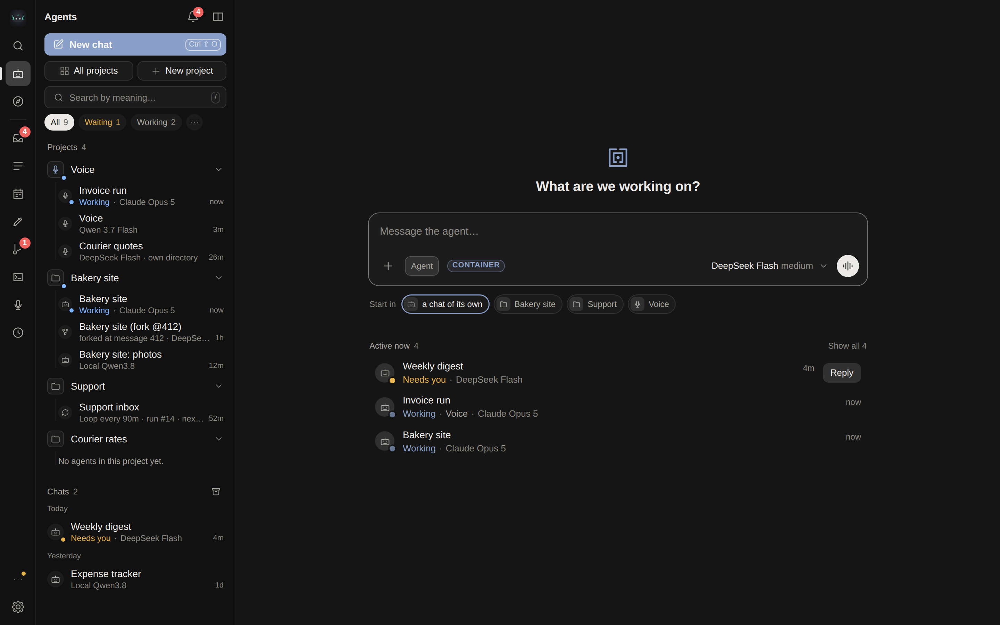
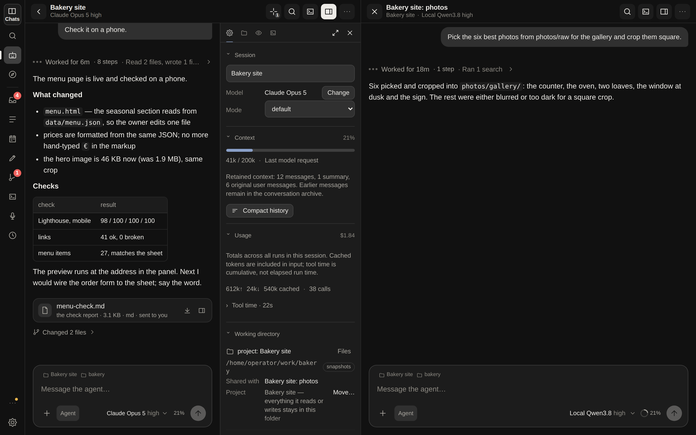
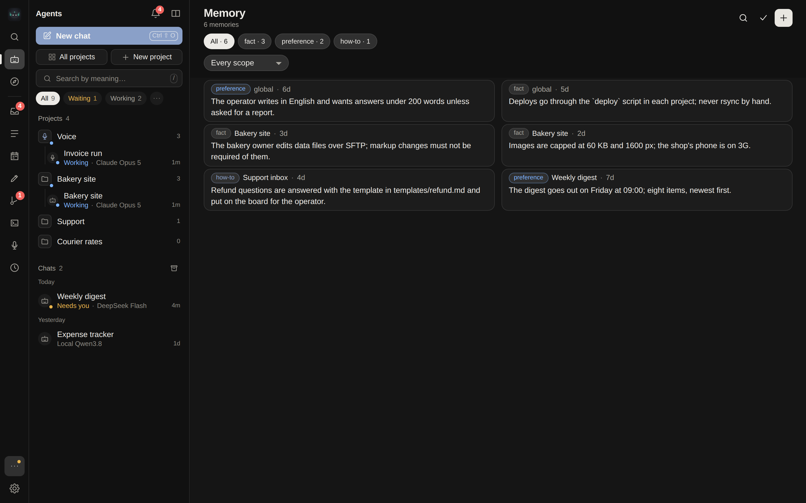
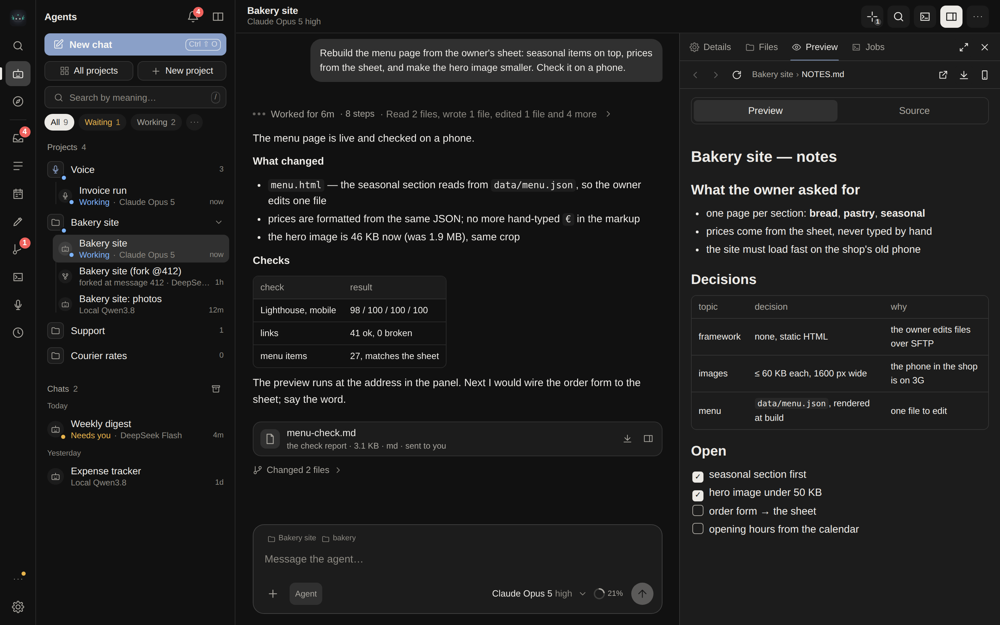
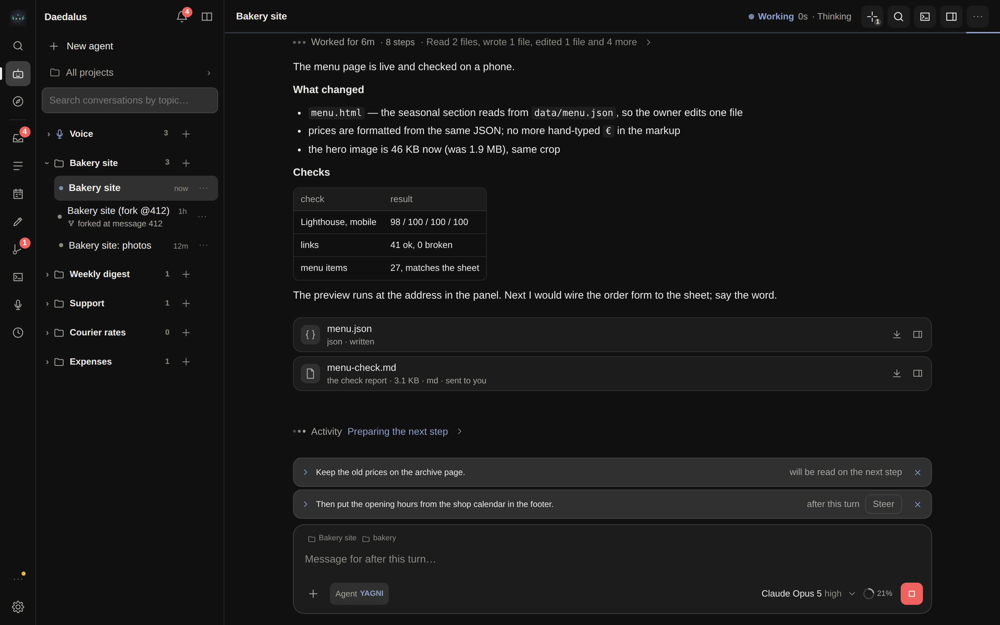
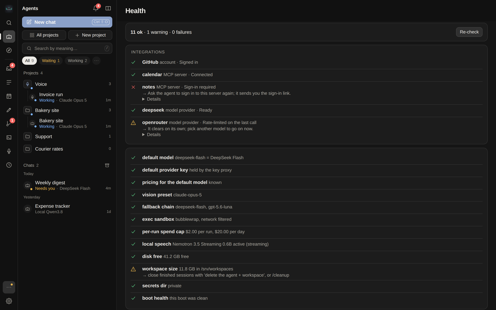
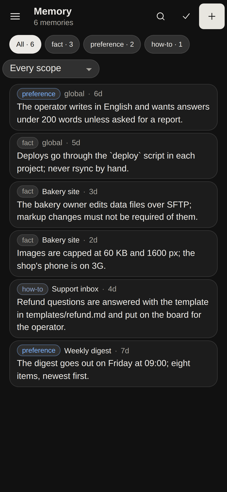

# What you get

<table>
<tr>
<td width="33%" valign="top">

**💬 Telegram-native** 
Every session has its own workspace and speaks in the chat under its own name — in the private chat alone, or in a forum topic each when you bind a group. Files in, files out, voice notes transcribed, questions as inline buttons, answers as rich messages that stream while they are written.

</td>
<td width="33%" valign="top">

**🖥️ A real web app** 
Every screen is an address under `/app`: agents, live transcripts, the files an agent sends you attached under its answer, a file browser with previews (images, Markdown, CSV, PDF, Word, Excel), the files and receipts an answer cites as chips that open the file at the lines it named, two sessions side by side, drag-and-drop and clipboard attachments, a microphone. Four tabs on a phone, a rail and a ⌘K palette on a desk. Installable as a PWA.

</td>
<td width="33%" valign="top">

**🛠️ Real tools** 
Shell, files, search, web fetch and search (keyless out of the box, self-hosted SearXNG behind a profile), a vision model for images, verification runs, MCP servers per session, skills the agent loads on demand.

</td>
</tr>
<tr>
<td valign="top">

**🔁 Autonomy that stays on a leash** 
Loop agents wake up on an interval or when they say so; cron tasks run in fresh or standing sessions; a heartbeat checks in; every agent keeps its own task board and an inbox keeps you informed. Every run has turn, spend and time limits, and a provider outage pauses the work instead of ending it.

</td>
<td valign="top">

**🧬 Self-development** 
The agent edits its host or its core in a git worktree, opens a PR, you approve or reject with a reason in the chat. The supervisor pulls, runs preflight and restarts — and rolls back a bad build on its own. On an installation with no GitHub token the same editing stays local; on one that should not change itself at all, the whole subsystem is absent.

</td>
<td valign="top">

**🔐 Keys it never sees** 
Provider keys live in a key proxy — a second container in Docker mode, a second process on `127.0.0.1` natively — that injects them into upstream calls and stops paying once the daily budget is spent. The agent's own process never holds one. Your ChatGPT, Claude Code and SuperGrok logins work as providers too, with their quota windows on screen. A password of your own — a router's, a service's — goes in through the composer's + → Secret (or `/secret` in Telegram): stored encrypted, the agent knows it only as `«secret:name»`, types it into a page, passes it to an MCP tool or reads it in a command as `$DAEDALUS_SECRET_NAME`, and everything that prints it comes back as the placeholder.

</td>
</tr>
<tr>
<td valign="top">

**🎙️ Voice (beta)** 
Talk to a small fast model that answers out loud in a second, hands anything substantial to an agent session while you keep talking, and tells you when one finishes. See [Voice mode](VOICE.md).

</td>
<td valign="top">

**📁 Projects** 
Add a folder of your own — a repository, a directory of documents — and the agents you start in it work there. Every path they resolve is checked against that folder and one that leads out is refused, not followed: the file tools, the file browser, the preview, the download and the files they send you. `Exec` runs in the folder and is bounded by the sandbox where one is on and by the policy rules where it is not. Several agents share one project and see the same files; an agent started without one still gets a scratch directory of its own, as before. One folder may belong to several projects — it is one place on disk, and each project's rules bind its own agents — but folders never nest: a folder inside another project's, or around it, is refused. When an orchestrator asks for a folder, the request is a card in its chat; an approval that cannot be carried out says why there and in a notification.

</td>
<td valign="top">

**🖥️ An app, not a deployment** 
One download opens a window of its own on macOS, Linux and Windows — the system's web view, or a browser window with nothing around it, decided at run time and never a hard failure. Native mode needs no Docker at all: about 100 MB into a folder the launcher owns, and four seconds from launch to the app.

</td>
</tr>
<tr>
<td valign="top">

**🧾 Evidence you can open** 
An answer that cites a file or a check carries it as a chip: click it and the file opens at the lines it named. `Verify` records a receipt against a criterion, and a change to the agent's own code cannot be applied without one that covers the bytes in it.

</td>
<td valign="top">

**📦 A context that stays bounded** 
A single tool result is clipped to a limit you set; the twenty results already behind it are trimmed to their heads as the turn moves past them, in batches, so the request stops growing without the transcript losing anything. The stored history keeps every result whole — only the copy sent to the model is cut.

</td>
<td valign="top">

**🧩 An installation that says what it is** 
`GET /api/capabilities` answers what *this* install can do — which self-development mode it resolved and why, whether a change is waiting for a restart — and the app, the prompt, the tool registry and the doctor all read that one answer. A tool the installation cannot honour is not registered at all, so the model is never offered a name that fails.

</td>
</tr>
</table>

## More pictures

<table>
<tr>
<td width="50%"></td>
<td width="50%"></td>
</tr>
<tr>
<td align="center">Agents — grouped by project; a fork sits under its origin, a loop shows its cadence</td>
<td align="center">Two sessions side by side; each pane has its own files and settings</td>
</tr>
<tr>
<td></td>
<td></td>
</tr>
<tr>
<td align="center">Memory — what the agent remembered, global and per session; edit, add, forget in bulk</td>
<td align="center">The panel — files, previews and uploads beside the conversation</td>
</tr>
<tr>
<td></td>
<td></td>
</tr>
<tr>
<td align="center">Written during a run — queued for the end of the turn; Steer hands it to the agent now</td>
<td align="center">Health — each integration and check in one line, and the fix for the one that fails</td>
</tr>
</table>

  

