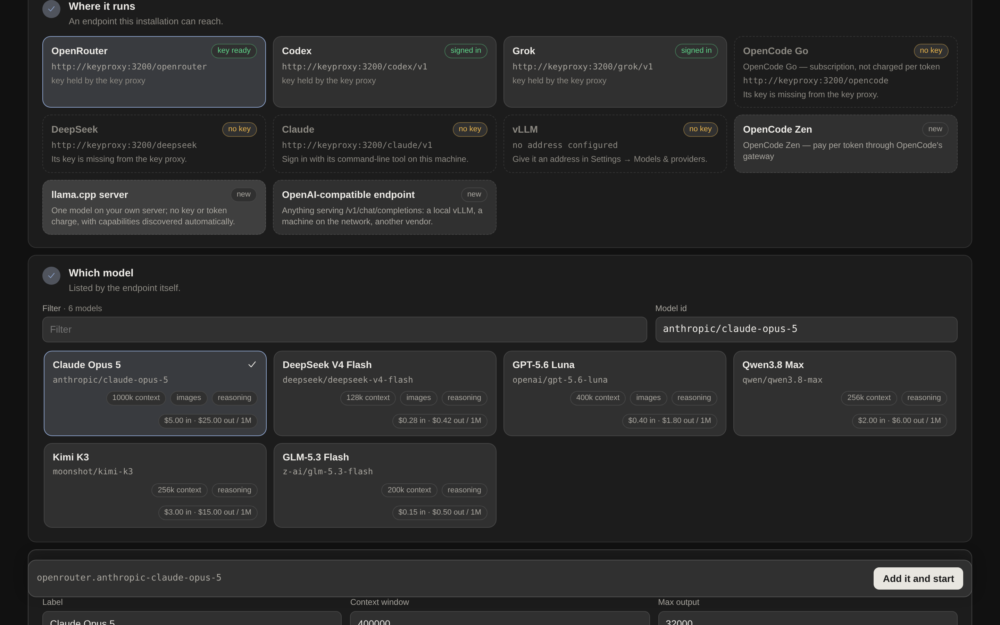
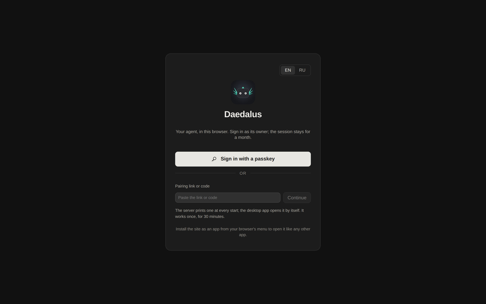

# Running Daedalus

Two programs, three ways in. **The desktop app is the one to start with**; the server install is the
same stack with a domain in front of it.

## 1. The desktop app

One download, one folder, and everything the installation owns is inside that folder — including, in
native mode, the Python it runs on. Nothing is installed system-wide and nothing is put anywhere
else, so uninstalling is deleting the folder.

```sh
curl -fsSL https://raw.githubusercontent.com/anchor-inference/daedalus/main/desktop/install.sh | sh
```

That takes the newest `desktop-v*` release, checks its signature by the project's release key
(fingerprint in the [README](../README.md#run-it)) and the download against its `SHA256SUMS`, and
unpacks it into `./Daedalus`. By hand, take the archive for your machine from the
[releases](https://github.com/anchor-inference/daedalus/releases): `Daedalus-macOS.zip` holds
`Daedalus.app` for both kinds of Mac and is opened with a double-click,
`daedalus-desktop-linux-<arch>.tar.gz` and `daedalus-desktop-windows-amd64.zip` hold the executable.

Open it and a page asks the one question that matters, with what each answer costs written beside it
(`--mode native` / `--mode docker` answers it from a script):

| | **Native** — no Docker | **Docker** |
|---|---|---|
| Needs | nothing at all | Docker Desktop or Docker Engine |
| First run fetches | **103 MB** on Linux, ~96 MB on macOS, ~148 MB on Windows — a pinned `uv`, a CPython, `rg` and the app's environment, each checked against the hash its publisher published | **114 MB** to pull one image (478 MB unpacked), plus Docker itself: a ~600 MB application with a VM disk behind it |
| Ready in | 26 s from an empty folder, **4.3 s** warm | seconds, once Docker is up |
| The agent is | a process under the launcher, which keeps it alive and stops it on quit | a container that comes back with the machine |
| Isolation | the policy rules, and bubblewrap on Linux where it can actually run — see [what each gives up](#what-each-gives-up) | the container's own edge |

Then it opens a window of its own — the system's web view on macOS and Windows, a browser window
with no tabs or address bar on Linux, the default browser if neither — asks for a provider key and a
daily cap, and hands you the app. [desktop/README.md](../desktop/README.md) has the folder layout, the
window's three fallbacks, the disk each mode takes, projects in Docker mode, local self-development,
release signing and uninstalling.

## 2. A server

The same stack with Compose in front of it: one published image, three containers from it (the agent,
the key proxy and the terminals), and every other piece behind a profile that is off unless you ask
for it.

Requirements: Docker with Compose, and at least one model API key **or** a ChatGPT / Claude Code /
SuperGrok login on the host. **Telegram is optional**: with a bot token you get the chat as a front;
without one the app in the browser is the whole interface.

```bash
git clone https://github.com/anchor-inference/daedalus
cd daedalus
bash deploy/setup.sh            # asks for the values, writes .env and ../daedalus-secrets/keyproxy.env, starts the stack
```

Or have a coding agent do it: [`docs/AGENT-SETUP.md`](AGENT-SETUP.md) is written for one, every
step a command with the output it must see. [Let your agent install it](#let-your-agent-install-it)
below has the paragraph to paste.

By hand instead: clone `protocore-exp` next to this repository, copy `deploy/env.example` to `.env` and
`deploy/keyproxy.env.example` to `../daedalus-secrets/keyproxy.env` (provider keys go there, outside the
checkout, `chmod 600`), then `docker compose -f deploy/compose.yaml --env-file .env up -d --build`.

| `--profile` | What it starts | Cost |
|---|---|---|
| `telegram` | the local Bot API server: files up to 2 GB instead of 20 MB (it needs `TELEGRAM_API_ID` / `TELEGRAM_API_HASH` from https://my.telegram.org/apps) | ~66 MB |
| `search` | a self-hosted SearXNG. Without it `WebSearch` goes to DuckDuckGo directly; with it, SearXNG is the backend the tool falls back to | ~382 MB |
| `selfdev` | the rebuilder, the only container that can reach Docker. Needed only to build a new agent image, which is what a change to the image's own recipe asks for | ~237 MB |
| `browser` | the agent's browser: `browserd` and Chromium from the `:browser` image target, on a network of its own ([below](#the-agents-browser)) | the `:browser` tag |

The browser skills — driving a page with Playwright, drawing with Pillow — are not in the default
image either: they are two thirds of one and most sessions never open a page. Run the `:browser` tag
instead (`ghcr.io/ascorblack/daedalus:browser`, 368 MB to pull) where they are wanted; without it the
skills say so instead of writing scripts that cannot run, and `daedalus doctor` says it too.

## Terminals

The shells the app opens in the container run in a third container, the `terminals` service: the same
image started as `ptyd`, the terminal daemon. It is a service of its own so the terminals outlive the
agent. What survives what:

| | Container terminals |
|---|---|
| `docker restart deploy-daedalus-1`, a self-development rebuild (`up -d --no-deps daedalus`), the agent's own restart | keep running; the app reattaches |
| `docker compose up -d terminals` after the image changed, or **Update** in the app | end — every one of them |
| `docker compose down`, a reboot | end |

- **The first deploy that has it needs `docker compose -f deploy/compose.yaml --env-file .env up -d --build`**,
  not a restart of the agent's container: the service is new, the agent gains a volume, and an image
  built before the service existed has no daemon in it. Until then `daedalus doctor` reports the
  container terminals as not installed and names that command.
- **Updating the daemon.** A deploy never recreates the service, so after a rebuild the image can hold a
  newer `ptyd` than the one running. The app and the doctor say so, and the update — recreating the
  service, which ends every container terminal — is the operator's, with the count of what it ends
  shown first. The app's button asks the `selfdev` rebuilder to do it; without that profile, run
  `docker compose -f deploy/compose.yaml --env-file .env up -d terminals` on the server.
- **Ports.** A server started in a terminal (a dev server, a preview) listens in `TERMINALS_PORT_RANGE`,
  `8120–8139` by default, published on every interface like the agent's own `8100–8119`, and reached
  at `SERVICES_PUBLIC_HOST:<port>`. The two ranges must not overlap.
- **Its home.** `/root` in the service is the `terminals-home` volume: CLIs installed there, their
  logins, shell history. It is never mounted into the agent's container.
- **Project folders.** A folder mounted into the agent's container is mounted into `terminals` too, at
  the same absolute path, so a path means the same thing in a terminal as it does to the agent. The
  desktop launcher writes both entries itself.
- **The sandbox toggle.** A terminal is an ordinary shell by default. With **Sandbox** ticked in the
  terminal menu it runs in bubblewrap instead: the filesystem read-only, the project's writable folders
  writable (what the session's own `Exec` may write), a private `/tmp`, and the daemon's token hidden.
  It is a wall against writing, not reading. For it the `terminals` service carries `cap_add:
  [SYS_ADMIN]` with unconfined seccomp and AppArmor — the same widening the agent's container accepts
  for `Exec`'s sandbox. Without them the toggle shows as unavailable, with the reason, and terminals
  open unsandboxed.

## The agent's browser

A Chromium the agent drives and you watch live in the app: the `browser` service, the same image's
`browser` target (`ghcr.io/ascorblack/daedalus:browser`) started as `browserd`, the browser daemon.
It is behind a profile, so an installation that never browses pulls nothing extra: add
`COMPOSE_PROFILES=browser` to `.env` (it then holds for every compose command, the rebuilder's
included) and run `docker compose -f deploy/compose.yaml --env-file .env up -d --build`. Until then
`daedalus doctor` says the browser is not installed and names that line.

- **Its walls.** The service is on a network of its own, `browser`, with **no route to the key proxy,
  SearXNG, the agent or the terminals**, and it mounts no workspace and no project folder: a file
  reaches a page, or leaves one, only through the host. Inside it, every connection Chromium makes
  goes through the daemon's own proxy, which resolves names itself and refuses private and LAN
  addresses, cloud metadata, and the installation's own ports, whatever a page or a redirect asks
  for. The agent's services are the exception, by design: `http://127.0.0.1:8103` in the browser
  opens the service published on the Docker host, and no other port there.
  [docs/architecture/browser.md](architecture/browser.md) has the rules.
- **Its privileges.** It runs as an ordinary user (uid 1001) with every capability dropped, a
  read-only root filesystem and `seccomp=unconfined`, which is what Chromium's own sandbox needs to
  give each page its own user namespace. Nothing else is widened — not `SYS_ADMIN`, not AppArmor,
  which the sandbox needs left in place on hosts that restrict unprivileged user namespaces.
- **What survives what.** Like the terminals, it outlives the agent: `docker restart`, a rebuild
  and the agent's own restarts leave every browser open. Recreating it — `docker compose up -d
  browser` after the image changed, or **Update** in the app — closes every browser. The profiles,
  and so the logins you made in them, stay in the `browser-state` volume; the app says how many
  browsers the update closes before it does.
- **Its size.** Memory is capped at `BROWSER_MEMORY_LIMIT` (3 GB): two browsers with eight tabs each
  measured under 1.2 GB. Settings → Browser sets how many run at once and when an idle one closes,
  and shows what they cost beside the terminals on one load bar.
- **What a page can still do to the agent.** A page may try to talk the agent into something: text
  addressed to it, a fake system message, an instruction hidden off screen. The agent is told that
  page text is data, not the operator's word, but a model can still be fooled. What the walls promise
  is what an obeyed page **cannot** reach: the key proxy, your local network and this installation's
  ports (the network wall), a password or payment field (the agent cannot type into one), a purchase,
  a message sent, a deletion or an upload (each asked about first), and, with an allowlist, any site
  off it — a link or redirect the page follows there is stopped and the agent told. It can still waste
  the agent's time on public pages. For more, Settings → Browser has **watch mode** (on the sites you
  list, the agent acts only while you have its browser open) and an **injection monitor** (a small
  model reads each new site's page before the agent and pauses on one that talks to it); both are off
  until you turn them on.
- **What is recorded.** The action log always: what the agent did, what it was refused, what a page
  did on its own. Keyframes of the pages only when you switch recording on — for one browser from its
  menu, or for every new one in Settings — kept a week within 500 MB, masked like any screenshot, and
  never while you drive unless you choose so.

## The host terminal (optional)

A shell on the server itself, as you, opened from the app like any other terminal. It is `ptyd` again,
the same binary as the container's, installed as a **systemd user unit of yours**:
`bash deploy/setup.sh` asks at its last step, and `bash deploy/host-terminal.sh install` does it on its
own. It copies the daemon out of the image the stack was built from into `~/.local/lib/daedalus/`,
writes `~/.config/systemd/user/daedalus-ptyd.service`, turns on lingering (so it survives your logout;
where that needs polkit, it prints the one `sudo loginctl enable-linger` to run) and starts it.

- **What it can do.** Everything you can do on the server: it is your shell, in your home, with your
  own logins — the `terminals-home` logins of the container terminals do not apply there. CLI staff and
  project folders on the host go through it as well (Docker installs only), and so do the git
  operations of staff worktrees in those folders.
- **What is recorded.** Every attach and detach, with how the browser signed in and how many bytes it
  typed, and every write an agent makes. **What you type is never recorded**: it would hold every
  password typed at a `sudo` prompt.
- **How the container reaches it.** Its socket and token live in `../daedalus-host-terminals`, beside the
  checkout (`DAEDALUS_HOST_TERMINALS_DIR` moves it), which compose mounts into the agent's container
  whether or not the unit is installed. An empty directory reads as "not installed", so installing or
  removing it needs no recreate. The directory is sealed from the agent's own commands. It needs
  Docker running as root: with rootless Docker or userns-remap, root in the container cannot open your
  `0700` directory, and the app says "permission denied".
- **What survives what.** `docker restart`, a rebuild and recreating the containers leave it running.
  `systemctl --user restart daedalus-ptyd`, a reboot, and re-running the installer (which updates the
  daemon to the image's) end every host terminal; setup asks before it does.
- **Removing it:** `systemctl --user disable --now daedalus-ptyd`, or `bash deploy/host-terminal.sh
  remove`, which also deletes the unit and the binary. `bash deploy/host-terminal.sh status` says where
  it stands, and `daedalus doctor` names the fix for each way it can be down.

## Host terminals on the desktop

A native desktop install has host terminals only: shells on your own machine, as you, served by the
`ptyd` each release carries beside the launcher. Restarting or updating the agent leaves them running;
quitting the launcher ends them, as it ends the agent. On Windows the shell is PowerShell.
[desktop/README.md](../desktop/README.md#host-terminals) has the details.

## The install ends in the app: add a model

**Whichever way you installed it.** A provider key is an address, not a choice of model, so nothing
is picked for you and the installation ships with none. The app opens on *Add a model* until one
exists: pick an endpoint, pick a model from the list it serves — with its context window, its
modalities and its prices beside it — and save. The same screen adds the next one later, from
Settings → Models.

<p align="center"></p>

## What each gives up

Nothing here is a tier: it is the same program, and each row is a real consequence of where it runs.

| | Native | Docker desktop | Server |
|---|---|---|---|
| **Isolation** | no container boundary: `Exec` runs as you, behind the policy rules, the approval gates and — on Linux where bubblewrap actually runs, which is now probed rather than assumed — bubblewrap, which confines what a command writes and not what it reads. Two rules exist only here: the installation's own files (the provider keys, the whole state directory, the launcher, its environment file and its runtime) are refused to read as well as to write, and a path in your home folder outside every project is a question you answer once | the container's edge, as on a server | the container's edge |
| **Telegram** | `api.telegram.org`, so files are capped at 20 MB in and out | the local Bot API server behind `--profile telegram`: 2 GB | the same profile |
| **Self-development** | `local`: the agent commits into the checkout the app runs from and the change applies on a restart, with a preflight on a copy of itself first and an automatic rollback if it cannot stay up | `local` by default; `server` with a GitHub token | `server`: a worktree, a pull request you approve in the chat, a merge, a rebuild |
| **Browser skills** | `daedalus-desktop install browser`, into the folder | the `:browser` tag | the `:browser` tag |
| **The agent's browser** | `browserd` beside the launcher, Chromium from `install browser`. **The daemon's proxy is the only wall** between a page and your machine's ports and LAN | the `browser` service: a network of its own, not root, no folders, and the proxy inside it | the same |
| **Reach** | your machine only: services a session starts bind `127.0.0.1` | the same | a domain, a PWA, Telegram's Mini App |
| **When you close it** | the agent stops, and a run in flight is drained, snapshotted and resumed on the next start | it keeps running and comes back with the machine | it keeps running |

## Signing in without Telegram

<p align="center">
  
</p>

A start with no other way in (no bot, no passkey yet) writes a one-time **pairing link** to `pairing-url` in the
state directory, readable by its owner only. Open it once and this browser is signed in; it expires after 30
minutes, is spent on first use, and using one revokes the rest. A fresh one:

```bash
docker compose -f deploy/compose.yaml exec daedalus python -m daedalus auth pair
```

Then add a **passkey** in Settings → Security: the key stays in the device (or its password manager) and signs
you in from the login screen with no link and no password. A passkey belongs to the address it was made at, so
set `MINIAPP_PUBLIC_URL` before enrolling one; on the machine itself, open the app at `http://localhost:8765`
rather than at the IP, which is not a name a key can belong to.

## With Telegram

1. Send `/start` to the bot in a private chat. That chat is a window onto one session at a time: `/new <title>` starts a session and writes to it, `/sessions` numbers them, `/use <n|title>` switches, `/close` puts one away. Every other session — a scheduled task, a loop agent, an agent you spawned — still speaks in the same chat, with its name above its words, and a question of any of them is answered back into it. Nothing else is needed.
2. Optional, for a chat of its own per session: create a supergroup with topics, add the bot as an administrator with *manage topics*, and send `/bind` there. One topic is then one session, and topics you create by hand are adopted too. Mini App → Settings → Chat switches between the two shapes.
3. Open the app with `/app`. Set `MINIAPP_PUBLIC_URL` to an HTTPS address that proxies to port 8765 and register it as the bot's menu button in @BotFather; the same address serves the browser version (sign in with Telegram's login widget), the shared services under `/s/…`, and a dialog shared from its menu under `/c/…`.

## Let your agent install it

Have a coding agent (Claude Code, Codex, Cursor, another Daedalus) set the server up for you: it follows
[`docs/AGENT-SETUP.md`](AGENT-SETUP.md), which is written for an agent — every step is a command with
the output it must see. Paste this into the agent, on a shell with Docker on the target server:

```text
Install Daedalus (https://github.com/anchor-inference/daedalus) on this server for me, following the
instructions for agents in docs/AGENT-SETUP.md of that repository exactly. Before you start, ask me
in one message for everything section 1 of that page needs (a model key or a CLI login to use,
whether I want Telegram, whether there is a domain, the daily cap, a GitHub token or "later").
Then clone, configure, start the stack, verify it as the page says, and give me the pairing link
and the two-line summary section 8 asks for. Never paste keys or tokens back into this chat.
```

## Models and keys

Providers are OpenAI-compatible endpoints (DeepSeek, OpenRouter, a self-hosted vLLM, anything else) with their own base URL, key and timeout; **presets** on top of them name a model with its thinking mode, effort, image support, context window and output cap. One preset is the default, others are fallbacks, any session can switch. Speech-to-text and the vision model pick a provider the same way.

**llama.cpp** is a first-class self-hosted provider. Add a `llamacpp` endpoint such as `http://127.0.0.1:8080/v1` or `http://<host>:<port>/v1`; no key is needed unless the server was started with one. Daedalus reads `/props` and `/v1/models` to prefill the model id, context window and image support, and reports tool support, slots, build and sleep state in the doctor. Older servers and proxies that expose only `/v1` still work: whatever they do not publish stays editable. Calls run on your hardware, are recorded at zero cost, and never consume a spending cap.

**An installation ships no preset at all.** The endpoints are configured; which model runs on one — and what it costs per million tokens — is the first thing you decide, in *Add a model* (the app opens there until a model exists, and Settings → Models → **Add a model** is the same screen). The first model added becomes the default. Until then every way in says so and names the fix rather than failing: the chat commands, the API (409), `daedalus doctor`, `daedalus check`.

Keys never reach the agent's process: the **key proxy** injects them (one path per upstream — `/deepseek`, `/openrouter`, `/opencode`, `/opencode_zen`, plus any `KEYPROXY_UPSTREAM_<NAME>` — under `http://keyproxy:3200` in a container and `http://127.0.0.1:3201` natively), meters the calls, and refuses model calls once the daily budget is spent. OpenCode is sold two ways, and one `OPENCODE_API_KEY` serves both. An [OpenCode Go](https://opencode.ai/go) subscription is the `opencode` provider (`/opencode`, `billing = "subscription"`): its models (DeepSeek, GLM, Qwen, Kimi, MiniMax, GPT-5.6 Luna …) are prepaid, so their calls are recorded at $0 and never count against a dollar cap, and what is left of the plan's 5-hour, weekly and monthly allowance shows on the Usage screen. [OpenCode Zen](https://opencode.ai/zen) is the `opencode_zen` provider (`/opencode_zen`): pay per token at Zen's prices, refreshed daily from [models.dev](https://models.dev) and capped like any priced provider, with its free models free. Every request to either carries the session id the gateway routes and caches by. Your **ChatGPT (Codex), SuperGrok and Claude Code** logins are read from the CLIs' own auth files, refreshed in place, and exposed as the `codex`, `grok` and `claude` providers — their quota windows show on the Usage screen and beside every session that uses them.

## Without Docker, for development

```bash
uv sync --extra dev
uv run python -m daedalus check                  # configuration and tool registry
uv run python -m daedalus run -p "say hello"     # one session in the terminal
uv run python -m daedalus serve                  # the bot
uv run python -m daedalus auth pair              # a one-time link that signs a browser in
uv run python -m daedalus db vacuum              # reclaim the database file after a schema upgrade
uv run pytest -q                                 # tests
(cd miniapp && npm install && npm run build)     # the app, served by the bot from miniapp/dist
```
