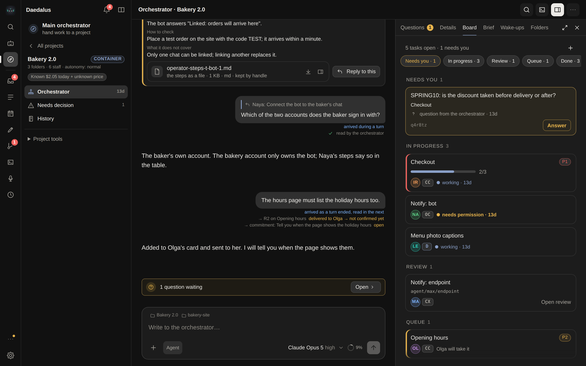

# Orchestration: from a goal to an accepted result

A project's orchestrator (the coordinator) plans the work, hands tasks to a small team, checks what
comes back and asks you only what it has to. This page walks the path once, then explains the parts
you will meet on the way.

  

## The first result, step by step

1. **Add a project.** Pick a folder (a repository or a directory of documents), write the goal, a
   constraint or two, the first task and how you will know it is done. Saving records the goal and
   its criteria; it starts nothing and spends nothing.
2. **Switch the orchestrator on.** Choose its model (the app checks the model answers before the
   switch is saved) and its autonomy — see below. The coordinator's chat opens.
3. **Hire a member.** A Daedalus agent, or a command-line agent such as Claude Code or Codex. Choose
   how it works in the folder: its own Git worktree, the shared folder, or read only.
4. **Say what you want in the coordinator's chat.** It assigns the task; the member works and hands
   in a report.
5. **Review.** Open the task: the member's original report, the checks it ran, the files it handed
   in (pictures show inline), and for a branch the diff. Record evidence for each criterion and give
   your verdict. A passing `Verify` run on the branch's current commit counts as evidence with one
   click.
6. **Merge and accept.** A branch is merged from the review card once the verdict is in — a folder
   without CI needs none, and required checks join the gate only when you name them. Accepting the
   result closes the task.

## Autonomy decides what the coordinator may do alone

| Autonomy | The coordinator… |
| --- | --- |
| **ask first** | brings you every decision; to assign and run a task it needs your permission for that task |
| **normal** (default) | plans, assigns, runs and reviews the project's tasks by itself; anything outside the brief comes to you |
| **full** | also answers its team's requests itself, always with a stated reason |

Under normal and full autonomy the permission is the setting itself: there is no per-task
permission step. Switching a project to *ask first* withdraws it at once.

## What needs you

One list per project — *Needs decision* — holds every question, review and missing input, each
once, with a link to where it came from. The sidebar and the phone show the same count.

## Changing the goal

Edit **Goals** or **Done when** in the project's Brief. The change starts from the current words.
You may tick open tasks the new goal changes: those and the tasks that depend on them go back to be
planned again, and their running workers stop. Tick nothing to keep the board as it is.

## The team

- **Own worktree** — the member works on a branch of its own; the board merges it when you accept.
  A project may name a **setup command** (`uv sync --frozen && npm ci`) that runs in each new
  worktree before the member starts; if it fails, the task stays unstarted with the last lines of
  its output on the card.
- **Shared folder** — the member works directly in the folder. Where the machine can contain a
  command-line writer (delegated cgroup v2), it does; elsewhere the member runs as an ordinary
  process.
- **Read only** — a command-line member starts in its CLI's own no-write mode (Claude and Grok in
  plan mode, Codex in its read-only sandbox, Cursor in ask mode). A CLI without such a mode cannot
  be read only, and the launch says so.

Services a member starts stop when its session ends.

## Folders on the host

When Daedalus runs in a container, a project folder may live on the host machine instead. Every
agent — Daedalus agents, the coordinator and command-line members — works there through the host
terminal daemon (`deploy/host-terminal.sh install`). While the daemon is not answering, a session in
such a folder is refused with the command that starts it.

## When something goes wrong

- A start that was interrupted, or a stop that was not confirmed, shows on the board with what to
  check and a button to release the task. The technical record is under *Details*.
- **Execution details** on a task say why a worker was stopped (for example, its memory limit) and
  **Copy diagnostics** puts the host's redacted fault list on the clipboard for a bug report.
- A goal's budget sits in the project's settings and header, and an accepted task shows what its
  result cost; an unknown price is shown as unknown, never as zero.
